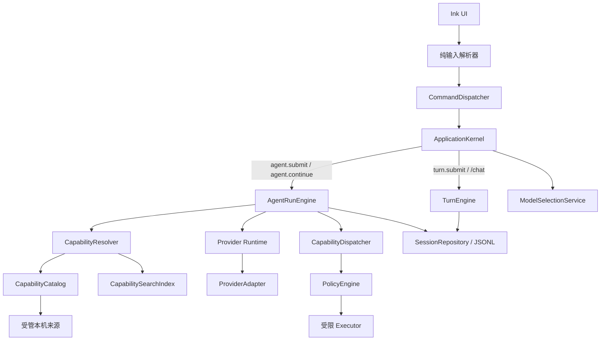
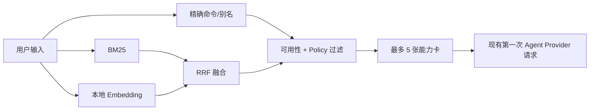

# MiniMax Coding-Agent 执行平面设计

**日期：** 2026-07-14

**状态：** 正式规格与 Task 1-22 实现已完成，确定性离线门禁已通过；真实 Granite 与 live Provider 验收待显式完成，默认 Agent 路由发布门保持关闭

**分支：** `codex/coding-agent-foundation`

**基线：** `0322780`，现有离线测试 `297/297`

## 1. 一句话目标

在不破坏现有聊天、会话、配置和本地文件的前提下，把 MiniMax CLI 从可靠的聊天壳扩展成一个可以发现本机能力、理解自然语言、受权限约束地调用工具，并且可以安全切换不同模型的 Coding Agent。

这次扩展采用“加一条新的 Agent 路径”，而不是重写已经稳定的聊天路径。

## 2. 已锁定的核心决定

1. `ApplicationKernel` 继续是唯一的类型化命令路由器。
2. 现有 `turn.submit -> TurnEngine` 是兼容和回退路径；`/chat` 始终可以显式进入它。
3. 新增 `agent.submit -> AgentRunEngine`，负责有限步数的模型—工具循环。
4. 持久层级是 `Thread -> Turn -> ordered AgentItem`；不新建独立持久化 `AgentRun` 实体。
5. 只发现已经安装且位于受管目录中的本机能力；除非用户明确要求安装某个具名项目，否则不联网搜索。
6. 能力召回采用 exact + BM25 + 本地 embedding + Reciprocal Rank Fusion；不增加一次远程路由模型请求。
7. 第一阶段只执行只读工作区检查和固定白名单的 npm 诊断任务。
8. 权限由用户选择“需要确认”或“当前 Session 完全访问”；召回置信度永远不能授予权限。
9. Provider 和模型通过版本化插件契约接入；MiniMax 是受保护的内建实现，Grok 只是未来可选 Provider 的一个普通例子。
10. 切换模型只改变当前模型运行时和一个用户级模型指针；项目文件、Thread、能力索引、工具和权限不随之改变。
11. 如果用户没有再次换模型，新 Session 继续使用上一次成功选择的模型；新 Session 的执行权限仍恢复为“需要确认”。
12. 第一阶段不把 LangChain 或 LangGraph 引入核心；只保留未来可选接入边界。

## 3. 背景

当前 CLI 已经具备并验证了以下基础：

- Node.js + TypeScript + Ink 交互界面；
- Command/RuntimeEvent 纯边界；
- `ApplicationKernel`、`CommandArbiter` 和工作区单进程租约；
- 多 Thread、Turn 生命周期、主动中断和故障恢复；
- JSONL 持久化、版本校验、原子文件写入和备份恢复；
- 上下文压缩、稳定摘要和本地安全 trace；
- Responses / Chat Completions Provider 协议、流式终止校验和错误分类；
- Provider 端点、凭证身份、系统钥匙串和明文回退安全边界；
- Windows/Linux 离线 CI 基础。

这些能力已经构成一套本地运行时。新设计必须在它们上面增量扩展，不能另起一套会话、权限或持久化真相源。

## 4. 目标

### 4.1 产品目标

- 非程序员可以用自然语言找到并使用已经安装的本机能力。
- 熟悉命令的用户仍可用精确斜杠命令，且不会经过语义猜测。
- 普通聊天保持快速、稳定，并有清晰的回退入口。
- 用户可以在多个模型和 Provider 之间切换，而本地工作环境不被重置。
- 故障、取消或进程崩溃后，不重复执行可能产生副作用的工具。

### 4.2 架构目标

- Agent 编排、能力检索、执行权限、Provider 协议和模型选择相互独立。
- 所有模型工具调用都转换成 Provider-neutral 的类型化动作。
- 所有本机工具执行都必须经过 `CapabilityDispatcher` 和 `PolicyEngine`。
- 派生索引、Provider 插件注册表和当前模型都采用 last-known-good 与原子发布策略。
- 旧命令、旧 JSONL 会话和现有 297 项测试保持兼容。

## 5. 非目标

第一阶段不实现：

- 任意 Shell 命令；
- 文件写入或删除；
- Git 修改、提交或推送；
- 在线搜索本机之外的新工具；
- 自动安装未具名项目；
- Provider 托管的网页搜索、代码执行、远程 MCP 或类似联网工具；
- 发布内容、账号操作或其他外部系统修改；
- 多 Agent、子 Agent 或模型并行比较器；
- LangChain、LangGraph 或 LangSmith 核心依赖；
- 自动下载 embedding 模型；
- 展示或保存模型私密原始推理。

## 6. 框架选择

### 6.1 当前选择

继续扩展现有的直接 TypeScript Runtime，不迁移到 LangChain/LangGraph。

原因：

- `ApplicationKernel`、`SessionService`、`TurnEngine`、JSONL 和恢复逻辑已经是当前状态真相源；
- LangGraph 的 checkpoint、thread 和恢复会与现有机制重叠；
- LangChain 的 Provider 与工具抽象不能替代现有凭证、权限和插件安全边界；
- 当前 Agent 循环仍然是单 Agent、有限步骤，尚未复杂到需要图编排框架。

### 6.2 未来扩展位

未来可以增加可选 `OrchestrationBackend`，让 `AgentRunEngine` 的复杂编排由其他后端实现。若以后出现大量条件分支、多 Agent、长时间人工审批图，可以单独评估 `LangGraphBackend`。

LangChain Provider 包也可以被某个可选 `ProviderAdapter` 包装，但它不能接管：

- MiniMax Codex 的凭证保存；
- 权限模式；
- Thread/Turn/AgentItem 持久化；
- 能力索引；
- 本机执行策略。

第一阶段不安装或加载这些框架，因此没有隐藏的启动、包体或网络成本。

## 7. 总体架构



### 7.1 唯一路由规则

`ApplicationKernel` 只根据已经类型化的 `Command` 路由，不读取原始文本猜意图。

- `turn.submit`：完全保留现有纯聊天行为。
- `agent.submit`：进入能力召回和 Agent 循环。
- `agent.continue`：在同一个暂停 Turn 上增加一段有界预算。
- `capability.invoke`：未来精确动态能力命令的类型化入口。
- `model.list` / `model.switch`：列出和切换 `modelProfileId`。

`chat-input-policy` 仍然是同步纯函数。异步检索、Provider 调用和本机扫描不得放进 UI 或 parser。

### 7.2 产品切换顺序

开发期间普通文本继续走 `turn.submit`。只有在 Agent 垂直切片通过全部质量门槛后，普通文本才改为 `agent.submit`；`/chat` 永久保留为兼容与回退入口。

## 8. 持久化执行模型

### 8.1 层级

```text
Thread
  └─ Turn (chat 或 agent)
       ├─ AgentItem: model.action
       ├─ AgentItem: capability.request
       ├─ AgentItem: capability.result
       ├─ AgentItem: checkpoint
       └─ AgentItem: assistant.final
```

`TurnRecord` 是一次 Agent 执行的持久化根。它在兼容现有字段的基础上增加：

```ts
interface AgentTurnState {
  mode: "chat" | "agent";
  lifecycle: "running" | "paused" | "completed" | "failed" | "interrupted";
  budget?: AgentBudgetLedger;
  pauseReason?: AgentPauseReason;
  continuationGeneration?: number;
}
```

字段形状是设计契约，最终类型名可在实施计划中根据现有 `TurnStatus` 做最小迁移。

### 8.2 AgentItem 原则

- Item 按 durable sequence 严格排序。
- Item 保存可审计动作和结果，不逐 token 保存模型私密推理。
- 每个工具请求使用稳定 `invocationId`。
- 工具结果必须引用同一个 `invocationId`。
- Provider、Provider Profile 和模型身份记录在产生该动作的 Turn/Item provenance 中。
- 老的聊天消息继续使用现有 `ThreadItem` 语义。

### 8.3 `/continue`

`/continue` 不新建 Turn，也不从头重放模型和工具。它：

1. 读取同一 Turn 的最后一个 checkpoint；
2. 保留全部已经完成的 AgentItem；
3. 增加一段新的时间、步骤和 token 预算；
4. 递增 `continuationGeneration`；
5. 从确定的暂停点继续。

## 9. 本机能力发现

### 9.1 来源范围

发现只发生在受管或明确配置的根目录：

1. CLI 内建命令和内建只读工具；
2. 项目原生目录 `<workspace>/.mini-codex/capabilities/`；
3. 用户原生目录 `<UserConfigRoot>/capabilities/`；
4. 项目兼容目录 `<workspace>/.agents/skills/` 与 `<workspace>/.codex/plugins/`；
5. 用户兼容目录，例如显式配置的 `$CODEX_HOME/skills`、`$CODEX_HOME/plugins`、`~/.agents/skills`；
6. 由 Claw compatibility adapter 返回的已注册、已启用根目录。

`UserConfigRoot` 沿用凭证模块的解析方式：`MINIMAX_CODEX_HOME` 优先，否则使用操作系统的用户级 `minimax-codex` 配置目录。

明确禁止：

- 扫描整个磁盘；
- 枚举所有 `PATH` 程序；
- 遍历任意 `node_modules`；
- 根据 README 猜测可执行命令；
- 因为没有匹配到能力而自动联网；
- 执行未在 manifest 中声明的入口。

### 9.2 兼容输入与统一描述

兼容适配器可以读取：

- Codex `SKILL.md`；
- Codex plugin manifest；
- 已支持的 Claw skill/plugin 定义；
- MiniMax 原生 `capability.json`。

所有输入只负责提供候选定义，必须先归一化为内部 `CapabilityDescriptor`：

```ts
interface CapabilityDescriptor {
  schemaVersion: number;
  id: string;                 // fully qualified and stable
  displayName: string;
  packageVersion: string;
  description: string;
  aliases: string[];
  keywords: string[];
  examples: string[];
  kind: "builtin" | "skill" | "plugin" | "command" | "tool";
  entry: CapabilityEntry;
  source: CapabilitySource;
  inputSchema: JsonSchema;
  safetyClass: CapabilitySafetyClass;
  idempotent: boolean;
  networkRequired: boolean;
  enabled: boolean;
  availability: CapabilityAvailability;
  contentHash: string;
}
```

安全类固定为有限枚举，不能由模型临时创造：

```ts
type CapabilitySafetyClass =
  | "catalog_read"
  | "workspace_read"
  | "local_diagnostic"
  | "workspace_write"
  | "network"
  | "external_mutation"
  | "install"
  | "unknown";
```

第一阶段 Executor 只接受前三类。`unknown`、写入、网络、外部修改和安装类即使被检索到，也不得进入第一阶段执行器。

缺少安全、网络或幂等声明时，按最低信任等级处理，模型不能自行补全。

### 9.3 安装与可用的定义

一项能力只有同时满足以下条件才是 `available`：

- 位于允许根目录且路径没有逃逸；
- manifest/schema 通过验证；
- 入口文件存在，符号链接最终路径仍在受管根目录内；
- 来源注册表标记为 enabled；
- 当前平台、Runtime 和声明依赖兼容；
- 没有被更高优先级定义 shadow；
- 所需 executor 已启用。

不可用定义仍可在 `/capabilities` 中显示原因，但不得进入可执行候选集。

### 9.4 重名优先级

内建保留 ID 永远不能覆盖。其他来源按以下顺序选择活动定义：

```text
项目原生 > 用户原生 > 项目兼容导入 > 用户兼容导入
```

定义绝不合并。低优先级定义保留为 `shadowed`，可供诊断；非限定名称只解析到活动定义。完全限定 ID 也必须在安全校验通过后才能显式使用。

同一来源中的重复完全限定 ID、同优先级 alias 冲突、路径逃逸、坏链接、无声明入口或无效 schema 只会隔离相关定义，不会使整个 Catalog 失效。

### 9.5 刷新与快照

- install/update/uninstall/enable/disable 等受管事件立即触发刷新；
- 手工修改通过受限目录的 debounce watcher 或 fingerprint 检测；
- 普通查询不重新扫描全部来源；
- Catalog 和 SearchIndex 完整验证后再原子发布；
- 查询始终使用一个不可变 snapshot；
- 构建期间继续使用上一个 last-known-good snapshot；
- Runtime-bearing plugin 更新尝试受控重建，失败则保留旧 Runtime，并提示新开 Session。

## 10. “索引树”与混合召回

### 10.1 数据结构

“索引树”不是严格的单父节点目录树，而是从同一份 `CapabilityCatalog` 派生的多入口索引：

- exact command/alias map；
- domain/action/object facet graph；
- BM25 inverted index；
- 本地 embedding vectors；
- availability、source、safety 等过滤索引。

同一个能力只保存一份 canonical record，可以通过多个意图路径被找到。

### 10.2 Intent document

每项能力生成一个短小 intent document，只包含：

- ID、名称、描述；
- aliases 和关键词；
- action/object/domain 标签；
- 少量人工维护的自然语言例句。

不把完整 README、任意代码或整个插件目录送入 embedding，也不送到远程 Provider。

### 10.3 BM25

中文和中英混合文本不能只按空格切词。第一阶段使用：

- Unicode 与大小写归一化；
- Latin token；
- CJK 字符 n-gram；
- alias 的完整 token；
- 轻量字段权重。

不额外引入中文分词模型。

### 10.4 查询流程



规则：

1. 精确斜杠命令优先并绕过语义召回。
2. 自然语言查询在同一个不可变 snapshot 上并行运行 BM25 和 cosine similarity。
3. 使用 Reciprocal Rank Fusion 合并名次，不直接混合不同量纲的原始分数。
4. 在进入模型前剔除 unavailable、disabled、shadowed 或 policy-ineligible 能力。
5. 最多注入五张紧凑能力卡。
6. 能力卡目标预算为约 500 token，硬上限是 `min(1200 token, 有效输入预算的 5%)`。
7. 同一个现有 Agent Provider 请求完成最终工具选择和参数生成；不增加第二个远程路由请求。
8. 模型返回值必须引用真实 `capabilityId` 并通过 schema/policy 校验，不能生成命令字符串后重新喂给 parser。

独立小型生成式路由模型暂缓；只有实测证明 Catalog 规模、召回质量或 prompt 成本需要它时，才重新评估。

## 11. 本地 Embedding 资源

### 11.1 选择

默认资源选择：

```text
模型：ibm-granite/granite-embedding-97m-multilingual-r2
资产：onnx/model_quint8_avx2.onnx
向量：384 维
运行输入上限：256 token
资源包：@minimax-codex/embedding-granite-97m-r2-avx2
```

资源包固定上游 revision `835ad14087e140460703cf0fae09f97d469d65c2`，qint8 权重的预期 SHA-256 为 `a6022dd8220ea6f6595562a1328ee216f4a94faa55362f2f4747c80f1e78772e`。这些值必须在实施前再次从正式来源核验并写入资源 manifest。

### 11.2 包边界

资源包独立版本化，约束如下：

- 只包含静态 ONNX、tokenizer/config、`resource.json`、许可证、notice、SBOM 和逐文件 hash；
- 没有可执行入口；
- 没有 lifecycle script、postinstall 或 downloader；
- 正常运行和第一次查询都不会静默下载模型；
- core 只解析静态资源路径，不 import 或执行资源包 JavaScript；
- tokenizer/ONNX runtime 关闭 remote model 和 custom code；
- 使用 CLS pooling 和 L2 normalization。

第一版优化包支持 Node 20 的 Windows/Linux x64 AVX2。缺失、损坏、不兼容或不支持 AVX2 时回退 exact+BM25。

### 11.3 生命周期

- Runtime 在后台懒加载并预热；
- 冷加载不阻塞当前查询；
- capability document vectors 是派生缓存；
- cache identity 包含索引 schema、模型 ID/version/hash、tokenizer 配置和 manifest fingerprint；
- 模型或 manifest 变化只重建受影响向量，最后原子发布新 snapshot。

如果 Granite 未通过本项目的中英混合召回或延迟门槛，记录的人工替代候选是 qint8 `intfloat/multilingual-e5-small`；不得自动联网替换模型。

## 12. Agent 执行与权限

### 12.1 第一阶段工具面

允许：

- 受工作区根目录约束的只读文件/目录检查；
- 固定参数、固定超时的工作区信息诊断；
- `package.json` 中明确允许且归类为诊断的 npm script adapter；
- `/capabilities`、状态和索引健康检查。

不允许：

- 任意命令行字符串；
- 运行用户输入拼出的 shell；
- 文件修改；
- 安装、发布、账号或网络动作；
- 任意 Git 写操作。

### 12.2 权限模式

用户在 Session 中明确选择：

```ts
type PermissionMode = "confirm" | "full_access";
```

- `confirm` 是每个新 Session 的默认值。
- Catalog/status 等无副作用动作可以直接执行。
- 第一阶段已验证、只读、幂等、工作区内的安全能力可以自动执行，并显示简短状态。
- `npm` script 即使名为 `test`、`check` 或 `build`，仍可能执行项目代码，不能仅凭名称判定为只读；它在 `confirm` 下需要确认，只有当前 Session 的 `full_access` 才能在已验证 manifest 和固定参数边界内免去重复确认。
- 未来任何写入、网络、安装、发布或外部修改在 `confirm` 下必须确认。
- `full_access` 只减少当前 Session 内、已授权范围中的重复确认。
- 用户可以随时降级权限。
- Session 结束后权限失效；恢复 Thread 或启动新 Session 不恢复 full access。

即使在 `full_access`：

- 不能扩大用户任务范围；
- 不能启用隐藏网络搜索；
- 不能安装未具名项目；
- 不能跳过 manifest/schema/路径/Policy 校验；
- 不能因为模型或召回分数很高而放宽权限。

### 12.3 执行顺序

一次工具调用必须按以下顺序发生：

1. Provider-neutral `tool_call` 到达；
2. 校验 capability ID、参数 schema、snapshot 和可用状态；
3. `PolicyEngine` 根据安全类、Session 权限和任务范围作决定；
4. 在 dispatch 前持久化带稳定 `invocationId` 的 request Item；
5. Executor 只接收类型化 `CapabilityInvocation`；
6. 执行完成后持久化引用同一 ID 的 result Item；
7. 结果再进入下一次模型请求；
8. 达到终止、预算或暂停条件时写 checkpoint/final Item。

任何模型输出都不能直接调用进程、文件系统或网络。

### 12.4 取消、崩溃和重放

- request 已记录但确认尚未 dispatch：可以安全继续。
- dispatch 已发生且没有 durable result：标记 `indeterminate`。
- 已完成的 invocation 永远不重放。
- 只有明确声明为只读且幂等的能力可以在有界策略下自动重试，并复用同一 invocation identity。
- 文件写入、安装、发布、账号/外部修改和未知安全类永不自动重试。
- 取消只有在 Executor 确认没有副作用完成时才记录 definitive cancelled；否则进入 indeterminate checkpoint。
- indeterminate 的非幂等动作暂停 Turn，用白话解释不确定性，等待用户 `/continue` 或专用 reconciliation。

## 13. Provider 与模型插件层

### 13.1 三种身份

```text
adapterId         = 协议实现和行为版本
providerProfileId = endpoint、认证和传输配置
modelProfileId    = 模型字符串和允许的推理参数
```

三者不能合并：一个 adapter 可以服务多个 Provider Profile，一个 Provider 可以配置多个模型。

### 13.2 ProviderAdapter 契约

```ts
interface ProviderAdapter {
  readonly manifest: ProviderAdapterManifest;
  validateProfile(profile: ProviderProfile): ValidationResult;
  describeFeatures(model: ModelProfile): ProviderFeatureProfile;
  createRuntime(input: ProviderRuntimeInput): Promise<ProviderRuntime>;
}
```

Adapter 包负责：

- manifest、版本和兼容范围；
- Provider/Profile schema；
- 凭证需求描述，但不直接保存凭证；
- request encoder；
- stream/event decoder；
- 错误归一化和 redaction；
- feature matrix；
- 可选的显式 health check。

Core 只消费 Provider-neutral action：

```text
text_delta | reasoning_metadata | tool_call | usage | completed | failed
```

原始 reasoning 不进入 trace、Thread 或模型上下文；只保留允许的安全元数据。

### 13.3 两级扩展

**Tier 1：配置复用**

兼容标准 Responses 或 Chat Completions 的服务复用内建 adapter，只新增 Provider/Model Profile。

**Tier 2：显式 Adapter 包**

真正不兼容的协议或 Provider 特性通过显式安装、启用的 Adapter 包接入。

Tier 2 不扫描任意 `node_modules`。只有位于 `<UserConfigRoot>/provider-adapters/` 且登记在受管注册表中的包可加载。激活前校验：

- manifest/schema；
- API 兼容版本；
- content hash；
- 路径 containment；
- feature contract fixtures；
- enabled 状态。

激活采用原子注册表发布；失败保留 last-known-good adapter registry。

MiniMax 内建 adapter/profile ID 受保护，不能被第三方覆盖。

### 13.4 第三方 Adapter 的信任边界

Manifest、hash 和路径校验只能证明“加载的是登记过的那份代码”，不能证明代码没有恶意。动态 Adapter 包属于受信任本机代码，必须由用户显式安装、查看来源并启用；不能因为包在磁盘上就自动执行。

Core 应尽量持有 HTTP transport、endpoint 校验、redirect policy 和 credential broker。普通 Adapter 只获得受限 transport port 与当前请求需要的认证句柄，不能自行读取 Credential Store。需要自定义签名、本机可执行程序或自定义网络栈的 Adapter 不进入第一轮 Tier 2，必须先完成单独 threat model；在没有可靠进程/系统隔离前，不得把“子进程”或“Worker”宣传成安全沙箱。

因此，阶段 6 的“显式第三方 Adapter”是后续发布门，不是第一轮已经授权的任意代码插件能力。

### 13.5 Feature matrix

至少声明：

- streaming；
- native tool calls；
- parallel tool calls；
- structured output；
- reasoning metadata；
- usage；
- prompt caching；
- image/audio input；
- Provider-hosted tools。

未知或不支持的能力在请求前失败。Provider-hosted web/search/code/MCP 是单独的网络权限类，不能因为选择了某个模型自动开启。

### 13.6 懒加载与故障隔离

- 非活动 adapter 不加载 SDK、模型 metadata 或凭证；
- 非活动 Provider 不发 health/network 请求；
- 一个 adapter 的失败只影响对应模型请求；
- 它不能修改能力索引、权限、已完成 AgentItem 或其他 Provider；
- Runtime-bearing 更新无法安全热替换时，保留旧 Runtime 并要求新 Session。

## 14. 模型切换与跨 Session 记忆

### 14.1 用户级当前模型

当前模型是全局用户级状态，不按工作区分别记录：

```ts
interface ActiveModelState {
  schemaVersion: 1;
  lastSelectedModelProfileId: string;
}
```

状态保存在 `UserConfigRoot` 下独立的 `model-state.json`，只含 schema 和完全限定模型 ID。它不包含：

- API key；
- endpoint 或 header；
- prompt；
- workspace 路径；
- Thread ID；
- 权限模式。

启动解析规则：

1. 有有效、已启用的 `lastSelectedModelProfileId`：使用它；
2. 没有该记录：使用配置的默认模型；
3. 主记录损坏但 backup 有效：恢复 backup；
4. 指针存在但 Profile/Adapter 已移除，或主备都无效：进入模型恢复界面，明确提供 configured default，不能静默选择无关模型。

启动只读取该指针，不在每个 Session 重写它。

### 14.2 事务性切换

模型只能在两个 Turn 之间切换。运行中请求切换会被拒绝并说明原因，不排队、不打断当前 Turn。

成功顺序：

1. 解析 `modelProfileId`；
2. 验证 Adapter、Provider、Model 和 feature contract；
3. 定位已经配置好的 credential；
4. 构造并验证新的 Provider Runtime；
5. 原子保存 `model-state.json`；
6. 同步原子替换内存中的 ActiveModelSelection/Runtime；
7. 后续 Turn 使用新模型并写入 provenance。

直到第 4 步成功前，旧 Runtime 一直可用。保存失败时旧指针和旧 Runtime 都不变。内存发布设计为不可失败的引用替换；若进程在保存后、发布前终止，下一次启动会按新指针构造一致 Runtime。

### 14.3 切换时不变的内容

模型切换不得：

- 修改 workspace/repository 文件；
- 改写工作区 `config.json`；
- 重建能力索引；
- 改变当前 Session 权限；
- 清空或改写 Thread；
- 改变 system instructions；
- 改变已安装工具；
- 自动迁移或新增 credential；
- 自动切换到另一个 fallback 模型。

允许变化的只有：

- 用户级 `lastSelectedModelProfileId`；
- 内存 Provider Runtime；
- Provider 侧 prompt cache 命中；
- 未来 Turn 的 provider/model provenance。

历史上下文保持 Provider-neutral。每次请求根据所选模型临时投影成该 Provider 的 wire format，不重写 durable history。模型切换本身不触发 compaction。如果新模型上下文不足，使用现有非破坏性上下文策略或明确失败，不静默换模型。

没有 native tool call 的模型仍可用于纯聊天；需要工具的 Agent Turn 在 dispatch 前显示兼容性错误。

### 14.4 配置兼容

现有工作区 `AppConfig.modelProvider`、`modelProviders` 和 `model` 继续作为 legacy/default 输入读取。切换模型不再通过 `ProviderService.switch` 改写整份工作区配置。

新的全局 current model 只能指向：

- 受保护内建 Model Profile；或
- 用户明确配置的全局 Model Profile。

工作区专属 legacy Profile 可以继续在原工作区使用，但若要成为跨项目全局 current model，必须通过单独、明确的 profile promotion/setup 流程写入用户级 Profile Store。这个设置动作和模型切换是两个操作，不能偷偷合并。

`/provider` 保持兼容，可解析到该 Provider 的默认 Model Profile，并使用同一事务性切换流程；新增 `/models` 和 `/model <modelProfileId>` 作为主要模型入口。

## 15. 用户可见性

普通请求保持安静：

- 实际选择或调用能力时显示一行：`已使用：<本机能力名称>`；
- 不默认展示全部候选、分数或 embedding 细节；
- embedding 缺失、后台刷新等预期降级只在影响当前结果时提示。

`/capabilities` 提供：

- 已发现能力及来源；
- enabled/available/shadowed/invalid 状态；
- safety class 和 network requirement；
- 当前 exact/BM25/embedding 模式；
- snapshot 版本和 freshness；
- 模型资源/hash 健康；
- 上次刷新问题；
- 显式 reindex 操作。

Provider/model 诊断显示 adapter/profile/model ID、版本、feature matrix 和 credential 是否存在，但不显示密钥或敏感 header。

## 16. 失败与降级

| 故障 | 行为 |
|---|---|
| embedding 包缺失/损坏/超时 | exact + BM25，聊天和 Agent 不阻塞 |
| 新索引构建失败 | 保留 last-known-good snapshot |
| 没有有效 snapshot | 从已验证 Catalog 构建 exact/BM25 最小路径 |
| 没有可靠能力匹配 | 不猜 Shell、不扫 PATH、不联网；说明未找到并提示 `/capabilities` |
| manifest 单项无效 | 隔离该定义，其他能力继续可用 |
| Provider Adapter 验证失败 | 不激活，保留旧 adapter registry |
| 模型切换验证或保存失败 | 旧模型继续有效 |
| 当前模型不支持工具 | 纯聊天可用，Agent 工具 Turn 请求前失败 |
| dispatch 后结果不确定 | `indeterminate` checkpoint，不重放非幂等动作 |
| 预算耗尽 | 同一 Turn 暂停，等待 `/continue` |
| Runtime 热替换失败 | 保留旧 Runtime，提示新 Session |

在线发现与安装是另一条显式工作流。任何检索失败、低分或 embedding 降级都不能自动触发网络。

## 17. 安全与可观测性

### 17.1 本地安全日志

允许记录：

- catalog/index snapshot version；
- adapter/profile/model ID 与版本；
- Turn model provenance；
- feature negotiation 结果；
- retrieval path 和经过脱敏的 candidate IDs；
- policy decision 和失败类别；
- latency bucket；
- invocation/checkpoint ID；
- fallback reason。

默认禁止记录：

- credential、Authorization 和敏感 header；
- 原始 Provider frame；
- 模型私密 reasoning；
- 完整用户 prompt；
- 未经同意的外部 telemetry。

### 17.2 权限与 Provider 隔离

- Provider 只能建议 tool call，不能执行能力。
- Provider feature profile 不能授予本机权限。
- 本地 embedding 不访问网络。
- 最终能力卡可能进入已配置的 Agent Provider 请求；这是唯一允许的能力元数据外发点，并受数量/token 上限约束。
- Provider 托管工具必须单独声明成 network capability 并重新经过权限设计。

## 18. 评估规格

### 18.1 关键零容忍失败

以下任意一项出现即阻止发布：

- 精确斜杠命令解析到错误能力；
- 模型或索引返回不存在的 capability ID 后仍被执行；
- 检索置信度提升权限；
- 未经明确请求发生网络发现或安装；
- unavailable、invalid 或 shadowed 定义被执行；
- 非幂等或 indeterminate invocation 被自动重放；
- 模型切换改变项目文件、Thread、能力索引、工具或权限；
- 凭证、原始 reasoning 或原始 Provider frame 进入 trace；
- 一个可选 Provider 的失败破坏 MiniMax 或 Agent core。

### 18.2 召回数据集

第一阶段至少 60 条人工标注的中英混合与口语化案例，覆盖：

- 精确命令和 alias；
- 中文、英文和混合语言同义表达；
- 跨 domain/action/object 的能力；
- 模糊匹配和多个合理候选；
- disabled、invalid、shadowed 和 stale 定义；
- 明确 no-match；
- 仅表达安装意图但没有具名项目；
- 明确要求安装某个具名项目。

普通输入默认切到 Agent 前，参考集扩展到至少 150 条，并加入真实失败样本。

### 18.3 召回门槛

| 指标 | 发布门槛 |
|---|---:|
| exact command correctness | 100% |
| 返回 capability ID 有效性 | 100% |
| natural-language recall@5 | >= 95% |
| top-1 accuracy | >= 85% |
| MRR | >= 0.90 |
| no-match precision | >= 95% |
| fused recall@5 | 必须高于 BM25-only，且不破坏 exact |

分别报告 exact+BM25、embedding-only 和 fused，不允许只报告最好的一组。

### 18.4 延迟与资源门槛

在声明的 Node 20、x64 AVX2 参考机器上：

- capability mode 关闭时，普通聊天 p95 回归不超过 2%；
- exact lookup p95 <= 10 ms；
- warm fused retrieval p95 <= 100 ms；
- embedding 查询硬 deadline 150 ms，超时回退 BM25；
- 路由增加的远程 Provider 请求数为 0；
- 最多五张能力卡，并满足第 10.4 节 token 上限；
- index rebuild 不在 query path 上发布半成品。

冷启动、后台模型加载、index build 和 snapshot swap 单独报告，不能混入 warm query 指标掩盖问题。

### 18.5 Provider conformance

每个 Adapter/Profile/Model 组合必须通过声明能力对应的离线 fixtures：

- request validation；
- text/reasoning metadata streaming；
- 完整、分片和并行 tool calls；
- usage 与 terminal completion；
- cancellation；
- malformed event 与 premature EOF；
- 结构化 Provider failure；
- retry boundary；
- redaction；
- unsupported-feature fail-closed。

Provider 只有在用户使用自己的 key 完成显式 live smoke 后才能被标记为“支持”。CI 不保存 key，也不自动执行 live smoke。

### 18.6 模型切换状态测试

必须证明：

1. Session A 选择 M1，新 Session 仍是 M1；
2. 成功切到 M2，新 Session 是 M2；
3. 验证或写入失败后仍是旧模型；
4. running Turn 中切换被拒绝；
5. 切换前后 Thread、summary、capability snapshot、tools 和 workspace 文件不变；
6. 当前 Session 的权限不因切换改变；
7. 新 Session 保留模型但权限恢复 `confirm`；
8. 历史 Turn 保留原 provider/model provenance；
9. 指针损坏/移除走显式恢复，不静默选择无关模型。

### 18.7 验证层次

1. 代码确定性检查优先：schema、路径、权限、状态、延迟和请求数。
2. 人工 UAT 检查非程序员是否理解能力选择、降级和不确定状态。
3. 暂不使用 LLM judge 作为发布真相源；未来若加入，必须有明确 rubric 并与人工评分校准。

## 19. 分阶段交付

### 阶段 0：契约落地，行为关闭

- 增加 Agent Command/RuntimeEvent；
- 增加 Turn/AgentItem 兼容 schema；
- 增加 ProviderAdapter、Profile 和 feature contracts；
- 建立 conformance fixtures；
- 现有普通文本仍走 chat。

### 阶段 1：模型选择与 MiniMax 兼容

- 先只用现有 MiniMax adapter；
- 分离 adapter/provider/model 三种身份；
- 加入全局 sticky model state；
- 加入事务性 `/models`、`/model`；
- 保持旧 `/provider` 兼容；
- 完成模型切换状态测试。

### 阶段 2：通用兼容 Provider

- 激活通过测试的 Responses/Chat Completions 配置型 Profile；
- 不启用第三方可执行 Adapter 包；
- 验证旧配置和凭证 identity 兼容。

### 阶段 3：本地能力平面，禁止执行

- manifest adapters 和 Catalog；
- exact/BM25/embedding/facet index；
- RRF、last-known-good snapshot 和刷新；
- `/capabilities`；
- report-only 召回与数据集评估。

### 阶段 4：只读 Agent 垂直切片

- Provider-neutral tool calls；
- `PolicyEngine`、`CapabilityDispatcher` 和受限 Executor；
- 只读工作区与 npm 诊断能力；
- budget、checkpoint、`/continue` 和保守恢复；
- 完成端到端 UAT。

### 阶段 5：产品切换

- 普通文本改为 `agent.submit`；
- `/chat` 永久保留；
- 只有在召回、延迟、恢复和兼容门槛全部通过后启用。

### 阶段 6：显式第三方 Adapter

- 启用受管 Adapter Registry；
- 每个 Adapter 独立安装、验证、禁用和回退；
- Grok/xAI 或其他 Provider 按普通 Adapter/Profile 流程接入；
- 不在 core 中加入 Provider 专属分支。

LangGraph、LangChain Provider wrappers、多 Agent 和模型比较器属于后续独立 spike，不属于上述第一轮交付。

## 20. 回退策略

每一层都能独立关闭：

| 层 | 回退 |
|---|---|
| 普通 Agent 路由 | 返回 `turn.submit` / `/chat` |
| embedding | 保留 exact + BM25 |
| capability execution | 保留 Catalog 和 `/capabilities`，禁止执行 |
| 新 index snapshot | 保留 last-known-good snapshot |
| 新 Provider Adapter | 禁用该 Adapter，保留 MiniMax 和其他 Provider |
| 模型切换 | 保留旧 Runtime 和旧指针 |
| Runtime-bearing plugin 更新 | 保留旧 Runtime，要求新 Session |

任何回退都不得删除 Thread、项目文件、能力 manifest、模型 Profile 或 credential。

## 21. 兼容性门槛

- 当前所有 `Command`/`RuntimeEvent` 的意义保持有效；
- `App.tsx` 仍只发送 Command、消费 RuntimeEvent；
- `turn.submit` 与 `/chat` 复现现有 Turn 行为；
- v0/v1 会话通过显式 reader/migration 载入，Agent 字段使用安全默认值；
- 新 AgentItem 类型在旧 context/summary/history 路径中默认排除，直到明确支持；
- 工作区配置不因模型切换发生写入；
- legacy Provider 配置继续可读，不做破坏性自动重写；
- 现有 297 项离线测试先保持全绿，新测试才计入完成；
- `npm run check`、`npm test`、`npm run build` 和 `git diff --check` 全部通过；
- 离线验证期间不访问真实 Provider，也不下载 embedding 资源。

## 22. 完成标准

- [x] 普通聊天路径与旧会话行为无回归。
- [x] 本机能力来源、manifest、shadowing 和刷新规则可验证。
- [ ] exact、BM25、embedding 和 RRF 满足质量/延迟门槛。（175 条离线数据与 fake-vector 门禁已通过；真实 Granite 资源验收尚未执行。）
- [x] embedding 缺失时自然降级，且不影响聊天。
- [x] 第一阶段 Executor 无任意 Shell、文件写入或隐藏网络能力。
- [x] 每个 invocation 具备 durable request/result 和保守恢复语义。
- [x] Session 权限与模型选择完全分离。
- [x] 模型切换只更新用户级模型指针和内存 Runtime。
- [x] 新 Session 继承模型，但不继承 full access。
- [x] 每个已启用的内建 Provider Adapter 通过统一 conformance suite。
- [x] 可选 Provider/Adapter 失败不影响 MiniMax 和 Agent core。
- [x] `/chat`、BM25-only 和 last-known-good snapshot 均可独立回退。
- [x] 不引入 LangChain/LangGraph 核心依赖，但未来扩展边界清晰。
- [x] 用户已复核并批准本正式规格；实施必须遵守独立阶段门禁。
