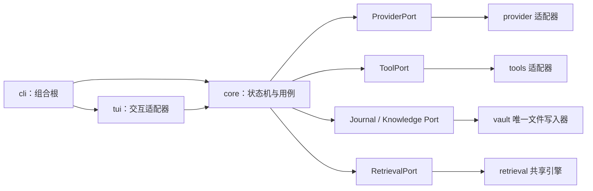

<!-- generated-by: gsd-doc-writer -->

# MiniMax Codex Rust + Vault 全量重写架构设计

| 项目 | 决策 |
|---|---|
| 状态 | 产品、架构和实施边界已确认；进入 SPEC 与纵向切片实施 |
| 日期 | 2026-07-15 |
| 目标平台 | Windows、Linux 首发；macOS 后续 |
| 交付形态 | 单个 Rust CLI 可执行文件；本地 embedding 模型是可选资源 |
| 兼容原则 | 保留现有外部命令、主要工作流和 Provider 行为，内部重新设计 |

## 1. 文档边界

本文描述未来 Rust 产品的目标架构，不表示这些 Rust crate、Vault 目录或迁移命令已经实现。

当前实现事实基于 2026-07-15 对 TypeScript 功能分支 `codex/fix-deepseek-tool-loop`、提交 `84784f5` 的只读核验：

- 当前生产检索已启用 exact + BM25；
- embedding 接口、Granite runtime、向量索引和 RRF 已存在，但没有完整接入生产构造路径；
- 当前检索对象是 capability catalog，不是 Wiki 或原始会话；
- 当前核心仍存在职责热点和类型耦合，不能按文件逐个翻译成 Rust。

本文中的目录树、crate 名称、端口和事件均为目标设计。具体依赖版本、embedding 后端和 BM25 实现留到实施计划阶段选定。

## 2. 背景与设计结论

Rust 重写的价值不只是把 GitHub 语言统计从 TypeScript 变成 Rust。它要同时解决四类问题：

1. **产品成熟度：** 单文件分发、可靠的终端生命周期、取消与恢复、结构化错误、跨平台发布。
2. **架构边界：** 核心状态机不直接依赖 UI、HTTP、Markdown 路径或具体工具实现。
3. **本地知识管理：** 使用普通文件和 Obsidian 兼容 Markdown 管理证据与长期知识，不引入 SQLite。
4. **行为可证明：** 用 TypeScript 版本作为可执行参考，通过确定性 Provider 和回放夹具逐个证明兼容性。

设计综合了三类参考，但不复制任何一个项目的整体结构：

- **OpenAI Codex：** 借鉴 Cargo workspace、薄 CLI/TUI、typed Op/Event 和追加式 rollout 证据；不复制其 SQLite 状态层。
- **claw-code：** 借鉴确定性 mock Provider 和 parity harness；不复制其较重的 runtime/commands 依赖关系。
- **Karpathy LLM Wiki：** 借鉴 immutable raw、compiled wiki、索引和维护循环；将 Obsidian 定位为可选查看器，而不是运行时数据库。

## 3. 目标

1. 用 Rust 完整替换主产品路径，TypeScript 暂时保留为行为基线。
2. 保持现有公共命令、交互工作流、Provider 协议和可迁移用户数据。
3. 建立单向依赖、typed command/event 和端口适配器架构。
4. 使用一个本地 Vault 保存可恢复的原始证据和 Agent 编译的长期知识。
5. 保证每个长期知识结论都能追溯到不可变 raw evidence。
6. 让 exact + BM25 成为无需模型资源的可靠基线，并真实完成可选 embedding 接线。
7. 为 capability catalog、开源项目目录和 Wiki 提供同一个检索核心、三个独立领域索引。
8. 在 Windows 和 Linux 上提供可测试、可恢复、可发布的单进程 CLI。
9. 以纵向切片迁移，每个切片都能独立运行并与 TypeScript 基线比较。

## 4. 非目标

- 不引入 SQLite、SQLx、Diesel、ORM、连接池或独立数据库服务。
- 不要求安装或启动 Obsidian；任何 Markdown 编辑器都能读取 Vault。
- 不在 v1 引入 Windows Service、systemd unit、后台 daemon 或第二个常驻进程。
- 不把 TypeScript 类和目录一对一翻译成 Rust。
- 不要求基础二进制包含 embedding 模型或 GPU runtime。
- 不把模型的私有推理过程写入 raw、Wiki、trace 或日志。
- 不允许 TUI、CLI、Provider 或工具实现直接读写 Vault 文件。
- 不把 `raw/`、`wiki/`、`log.md` 和派生索引设计成互相竞争的真相来源。
- 不在 v1 提供应用层 Vault 加密；文件透明性由 OS 权限和磁盘加密保护。
- 不在这份架构稿中锁定所有 crate 版本或实现库。

## 5. 固定产品决策

- Rust 是最终主实现，不是 TypeScript UI 下的一层加速内核。
- 外部兼容优先于内部形状兼容；旧内部结构可以完全删除。
- Windows、Linux 首发，macOS 在首版稳定后加入。
- CLI 保持单进程、单 workspace writer；Obsidian 只是并行读取和人工投递入口。
- 每个项目绑定一个独立 Vault，默认禁止跨项目检索或写入；未来全局知识只能作为显式启用的只读上层。
- 首次运行由用户选择 Vault 位置；默认建议放在项目仓库同级而不是 Git 工作树内部，并以 `project_id` 阻止静默换绑。
- `inbox/` 由人维护；`raw/` 由系统追加并在完成后冻结；`wiki/` 仅由 Agent 编译维护。
- 每个终态会话都自动创建本地结晶评估；只有出现新决策、变更、诊断、经验或待办时才调用模型，`/crystallize` 可以强制执行。
- crystallization 使用独立的 `MainModelWikiWorkflow`，由当前会话已经固定的主 Provider/主模型直接生成结构化 `KnowledgePatch`；core 校验后才允许 Vault writer 提交，失败不会反向把已完成 Agent 任务标记为失败。
- Wiki 默认只暴露一个当前有效结论；被取代的结论退出正常检索，但保留 raw evidence 和 supersession 关系。
- 系统正常情况下每 7 天至多扫描一次，磁盘空间紧张时立即扫描，但不会自动删除 raw；任何 raw 删除都必须经过引用检查、预览和用户确认。
- Vault 使用普通本地文件；凭据永不进入 Vault，高敏感项目由 OS 文件权限和 BitLocker/LUKS 等磁盘加密保护。
- 无 embedding 模型时产品仍完整可用，并明确报告 `exact+bm25`。
- embedding 只有在 Provider、模型资源、向量索引和端到端验证都可用时才报告为启用。
- 保留面向非编程用户的“按需求自动找开源项目”入口：先由 BM25 从需求中召回关键词和候选项目，再由 embedding 做语义匹配与重排；embedding 不可用时必须以 BM25 结果降级并明确说明。
- 对外只有两个权限档：`confirm` 对每次外部工具调用请求确认，`full-access` 在当前会话内自动执行允许的工具；重启后恢复 `confirm`，硬性安全限制不因 full-access 消失。
- Rust v1 工具范围固定为文件读取/列目录、patch/写入、有界 shell、Git status/diff 和 npm 诊断；MCP、插件和子代理不进入 v1。
- TUI 保留现有 slash commands；headless 提供一次性 run、JSONL 事件、doctor、migrate 与 Vault 维护命令。
- 上下文压缩由本地确定性结构化摘要完成，不额外调用模型；主模型上下文只含稳定短摘要、近期轮次、相关 Wiki 和 capability/project cards。
- 凭据解析顺序为环境变量优先、OS keyring 其次；无 keyring 的 headless 环境只接受环境变量，不持久化明文 secret。
- 旧数据迁移是显式、幂等、可审计操作；原文件在验收前不删除。

## 6. 总体架构



图中的箭头表示调用方向，不表示 core 依赖具体适配器。实际 Rust 依赖遵循依赖倒置：端口由 `core` 定义，适配器实现端口，`cli` 负责装配。

### 6.1 目标 Cargo workspace

```text
crates/
├── protocol/        稳定 ID、Command、Event、Provider/Tool 数据契约
├── core/            Agent 状态机、用例、端口、取消、权限和 crystallization 编排
├── provider/        HTTP/SSE、协议正规化、重试和 Provider 配置适配
├── tools/           工具发现、校验、执行适配器；不拥有 Agent 状态
├── retrieval/       共享 exact/BM25/embedding/RRF 引擎
├── vault/           journal、Markdown、事务恢复、索引缓存持久化
├── tui/             Ratatui/Crossterm 交互和纯事件 reducer
├── cli/             clap 命令树、配置解析、composition root、二进制入口
└── compat-harness/  确定性 mock、黄金夹具、TypeScript/Rust 行为比较
```

### 6.2 允许的依赖方向

| crate | 可以依赖 | 禁止依赖或拥有 |
|---|---|---|
| `protocol` | Serde 等纯数据依赖 | 文件系统、网络、终端、其他内部 crate |
| `core` | `protocol` | `provider`、`vault`、`tools`、`tui` 的具体类型 |
| `provider` | `protocol`、`core` 的端口 | Vault 路径、UI 状态、工具执行 |
| `tools` | `protocol`、`core` 的端口 | Provider transport、Wiki 文件、TUI |
| `retrieval` | `protocol`、`core` 的端口 | 业务文件路径、Provider 请求、UI |
| `vault` | `protocol`、`core` 的端口 | Provider 请求、终端渲染、工具执行 |
| `tui` | `protocol`、`core` 应用接口 | Provider、工具、Vault 的具体适配器 |
| `cli` | 所有需要装配的 crate | 业务规则和持久化格式解释 |
| `compat-harness` | 测试所需 crate | 生产运行时依赖路径 |

`cli` 是唯一 composition root。`core` 不使用文件路径、Markdown frontmatter、HTTP 客户端或终端 API。

## 7. 核心协议与状态机

### 7.1 Command/Event 边界

所有入口先转成 typed `Command`，所有可观察结果转成 typed `Event`。代表性命令包括：

```text
SubmitPrompt
InterruptRun
CreateSession
ResumeSession
SelectProvider
ApproveTool
RejectTool
Crystallize
RebuildIndex
RepairVault
Shutdown
```

代表性事件包括：

```text
SessionStarted
AssistantTextDelta
ToolCallRequested
ToolCallApproved
ToolResultRecorded
RunInterrupted
SessionCompleted
SessionFailed
CrystallizationPending
CrystallizationCompleted
CrystallizationFailed
RetrievalModeChanged
```

协议中的 ID、错误类别和 schema version 稳定；终端文案、时间戳和内部实现不作为兼容契约。

### 7.2 展示事件与持久事件

Provider 的每个 SSE 包不会原样进入磁盘。系统把它们正规化为两条流：

- **PresentationEvent：** 为 TUI 提供低延迟文本增量和进度，可丢弃后重建。
- **DomainEvent：** 保存对恢复和审计有意义的命令、批量文本、工具调用、工具结果和终态。

可见文本增量按有界策略批量写入；完成、中断、工具边界和退出会强制 flush。具体字符数和时间阈值在性能测试后确定，不写死在架构契约中。

### 7.3 核心端口

`core` 定义以下能力端口：

- `ProviderPort`：发送正规化请求，返回严格终态的事件流。
- `ToolPort`：描述、校验并执行已批准工具调用。
- `JournalPort`：追加 raw domain event、读取和终结会话。
- `KnowledgePort`：读取 Wiki 上下文、提交经过验证的 `KnowledgePatch`。
- `DerivedIndexPort`：读写可删除、可重建的索引快照。
- `RetrievalPort`：按领域执行检索并报告真实模式。
- `CredentialPort`：从环境变量或 OS keyring 获取凭据。
- `Clock`、`IdGenerator`：为测试提供确定性时间和 ID。

`vault` 可以同时实现 journal、knowledge 和 derived-index 持久化，但这些端口在 core 中保持语义分离，防止一个“大 Storage 接口”重新出现。

### 7.4 主 Agent 流程

```text
Command
  -> core 校验当前状态与权限
  -> 从 Journal/Wiki/Retrieval 组装有界上下文
  -> ProviderPort 流式生成
  -> 工具请求经过策略与用户批准
  -> ToolPort 执行并把结构化结果送回 core
  -> raw journal 先持久化终态
  -> 向 UI 发出 SessionCompleted/Failed
  -> 创建本地 crystallization evaluation job
  -> 无长期价值时写 no-op receipt，不调用 Provider
  -> 有长期价值时创建 synthesis pending job
  -> MainModelWikiWorkflow 使用当前固定主模型生成 KnowledgePatch
  -> core 校验来源、边界与期望 hash
  -> Vault writer 以可恢复 transaction 更新 Wiki
```

Provider 必须发出一个且仅一个合法终态。提前 EOF、无效 JSON、重复终态或终态后的数据都是协议错误，不能形成“已完成”消息。

## 8. Vault 数据模型

### 8.1 目标目录

```text
MiniMax-Vault/
├── AGENTS.md
├── inbox/
├── raw/
│   ├── sessions/
│   │   └── <session-id>/
│   │       ├── session.json
│   │       └── events.jsonl
│   ├── imports/
│   └── assets/
├── wiki/
│   ├── index.md
│   ├── sessions/
│   ├── projects/
│   ├── decisions/
│   ├── concepts/
│   ├── providers/
│   └── lessons/
├── log.md
└── .minimax/
    ├── manifest.json
    ├── locks/
    ├── pending/
    ├── transactions/
    ├── recovery/
    ├── indexes/
    └── trash/
```

不设置第三个顶层 `sessions/` 知识区。可读会话摘要位于 `wiki/sessions/`，完整事件位于 `raw/sessions/`，从结构上避免第三份真相。

一个 Vault 只绑定一个稳定 `project_id`。Vault 可以位于项目内、项目旁或用户指定位置，但 manifest 必须记录绑定关系；同一个 Vault 不能在没有显式迁移的情况下被第二个项目接管。默认检索只读取当前项目 Vault。

### 8.2 所有权与真相来源

| 区域 | 写入者 | 内容 | 是否权威 | 是否可重建 |
|---|---|---|---|---|
| `inbox/` | 人 | 待摄取笔记和文件 | 摄取前的用户原稿 | 否 |
| `raw/` | Vault writer | 会话、工具事件、导入原件、证据 | 历史事实和重建证据 | 否 |
| `wiki/` | Agent，经 Vault writer 提交 | 当前编译知识、会话结论和来源链接 | 当前知识视图 | 可从 raw + 规则重建 |
| `wiki/index.md` | Vault writer | 链接和一句话描述 | 导航，不是知识正文 | 是 |
| `log.md` | Vault writer | 操作 ID、时间、状态和目标 | 运维审计，不是会话事件库 | 可部分重建 |
| `.minimax/` | Vault writer | 锁、任务、事务、缓存、格式版本和 7 天回收区 | 恢复元数据，不是业务真相 | 缓存可重建；未完成事务和 trash 不可盲删 |

必要冗余只有一类：raw 证据和 Wiki 综合结论表达相关内容，但职责不同。禁止把同一正文复制到 session summary、topic page、index 和 log。

### 8.3 标识和 frontmatter

每个 Wiki 页面只有一个稳定 ID，保存在 frontmatter；文件名只是可变 slug，不承担身份语义。建议字段：

```yaml
---
id: knowledge_...
kind: decision
schema_version: 1
title: Example title
updated_at: 2026-07-15T00:00:00Z
status: current
source_ids:
  - session_...
supersedes:
  - source_id: session_previous_...
    superseded_at: 2026-07-15T00:00:00Z
tags:
  - example
---
```

`source_ids` 必须指向 raw evidence 或另一个有来源链的 Wiki 页面。没有可解析来源的事实不能作为 durable claim 提交。

同一主题产生新结论时，原 Wiki 页面使用稳定 page ID 原位更新，并在 `supersedes` 中记录被哪条新证据、在什么时间取代；旧结论正文仍可在 raw source 中还原。页面被拆分、合并或改名而不再有效时，只保留 `status: superseded` 的轻量 tombstone 并指向新 page ID。正常检索只索引 `status: current`，历史审计才显式读取 supersession 关系。

`AGENTS.md` 描述给人和 Agent 阅读的维护约定；`.minimax/manifest.json` 保存机器可读格式版本。程序不会把自然语言 `AGENTS.md` 当作数据库 schema，因此两者不是重复配置。

### 8.4 Raw journal

活动会话的 `events.jsonl` 只追加规范化 `DomainEvent`。每条 envelope 至少包含：

- `schema_version`；
- `session_id`、`event_id` 和单调 `sequence`；
- 安全时间戳；
- event kind 和验证后的 payload；
- 用于检测尾部破损的 checksum 或等价完整性信息。

`session.json` 保存状态、Provider、模型、开始/结束时间和最后有效 sequence。会话运行中可追加，写入终态并 flush 后变为 immutable。

崩溃恢复只允许截断未完成的最后一条记录；被截断字节先复制到 `.minimax/recovery/`。中间 sequence 缺失、checksum 错误或未知未来 schema 必须停止并进入 repair 流程，不能静默跳过。

raw 保存用户可见输入输出和安全的结构化工具事实，但不保存凭据、环境变量、完整请求头、秘密值或模型私有思维链。

### 8.5 项目隔离与本地保护

- 每个项目拥有独立的 raw、Wiki、pending、transaction 和 derived index 命名空间。
- 默认没有跨项目发现或检索；未来个人全局知识层必须由用户显式启用、标明来源，并且对项目 Vault 只读。
- Wiki、raw 和恢复元数据使用普通本地文件，不在 v1 增加应用层加密或专有容器。
- Vault bootstrap 必须提示其中可能包含源代码、会话和工具输出，并建议敏感项目启用 BitLocker、LUKS 或等价磁盘加密。
- 文件和目录使用当前 OS 可提供的最小权限；API key、token、cookie 等 secret 在写入前由统一 redaction 边界阻止。
- 若 Vault 位于 Git 工作树内，CLI 必须检测潜在提交风险并给出明确指导；是否自动生成 ignore 规则留到实施计划决定，不能擅自修改项目 Git 策略。

### 8.6 Raw 保留、清理与遗忘

清理遵循“引用优先、年龄其次、体积最后”。普通 `gc` 永远不能删除：

- Wiki 当前结论或 supersession 关系仍引用的 raw evidence；
- 会话的用户输入、最终回答、命令、关键工具结果和迁移 receipt；
- 未完成、待恢复、待结晶或 transaction 正在使用的数据；
- 用户显式标记为 `pinned` 的对象。

可重建索引、已完成 transaction 的 staging、内容 hash 完全相同的重复附件，以及超过 30 天且没有任何知识引用的大型构建日志、临时文件快照和完整工具附件，才可以成为候选。结构化事件仍保留原始 hash、大小、类型、产生者和清理原因，不能假装被清理的正文仍可读取。

CLI 正常情况下每 7 天至多执行一次轻量扫描；磁盘剩余空间低于 10%、可回收附件超过配置的 soft limit、用户运行 `vault gc` 或项目归档时可以立即扫描。扫描只生成按“永久证据 / 被引用 / 可重建 / 可清理”分类的报告，不自动删除 raw。

应用清理计划前必须重新计算从 Wiki source IDs、supersession、pending jobs、migration receipts 和 pins 出发的可达集合。计划显示每个候选的原因、大小和引用检查结果；用户确认后，raw 候选先移入 `.minimax/trash/<gc-id>/`，保留 7 天用于撤销，永久 purge 需要再次确认。可重建索引可以直接失效并重建，不进入 raw trash。

因隐私或合规要求删除仍被引用的内容不属于 `gc`，而使用独立的 `vault forget` 流程：先列出受影响的 Wiki 结论，移除或重新结晶这些结论，再清除敏感 raw，最后留下不含秘密的 deletion tombstone。`gc` 不提供绕过引用保护的 `force` 开关。

## 9. 文件一致性与恢复协议

普通文件系统无法提供多个 Markdown 文件的真正 ACID 事务。设计不声称 Wiki、index 和 log 能在一个 rename 中同时提交，而使用“单文件原子替换 + durable transaction manifest + 幂等 roll-forward”保证最终一致。

### 9.1 单 writer lease

一个 Vault 同时只允许一个 MiniMax CLI 写入。lease 使用独占创建、PID、启动时间和随机 nonce；清理 stale lease 前必须验证进程状态，释放时必须匹配 nonce。Obsidian 可以读取，但不参与写锁。

### 9.2 Wiki transaction

1. 在 `.minimax/transactions/<job-id>/` 生成所有候选文件。
2. 重新读取并验证 frontmatter、稳定 ID、wikilink、source ID 和目标路径。
3. 写入包含目标路径、旧 hash、期望 hash 和顺序的 manifest，并标记 `prepared`。
4. flush 文件和目录元数据。
5. 获取 Vault writer lease。
6. 按“知识页 -> `wiki/index.md` -> `log.md`”顺序逐文件原子替换。
7. 每一步都能通过目标 hash 判断是否已经应用；恢复时只做幂等 roll-forward。
8. 所有目标达到期望 hash 后写完成 receipt，再删除 pending marker。

如果进程在任一步崩溃，下次启动先读取 transaction manifest：目标 hash 已匹配则跳过，不匹配则从 staging 重放。因为 `wiki/` 是 Agent-owned 编译视图，优先收敛到已验证的新版本，不做可能覆盖新写入的盲目 rollback。

### 9.3 丢失窗口补偿

raw 会话终态必须先于 crystallization evaluation marker 持久化。若进程恰好在两者之间崩溃，启动扫描会查找“已结束但没有 evaluation receipt”的 session，并补建幂等 job。receipt 明确记录 `no_op`、`synthesized`、`pending` 或 `failed`，因此会话不会因 marker 尚未创建而永久漏掉评估，也不会因为无需结晶而被反复检查。

## 10. Inbox 摄取

人只在 `inbox/` 中新增或修改内容，Agent 不直接覆盖 inbox 原稿。摄取流程：

1. 读取文件并计算内容 hash，分配稳定 import ID。
2. 通过临时文件和 rename 把原始字节复制到 `raw/imports/`。
3. 重新读取并确认 hash；此时 raw 副本成为不可变证据。
4. 创建 Wiki transaction，所有结论引用 import ID。
5. transaction 完成后再从 inbox 移除原稿；移除失败只报告“已摄取但原稿仍在”，不重复编译。

若步骤 2 之后崩溃，同一内容 hash 会解析为同一 import ID，重试不会制造第二份事实。无法解析的二进制文件可作为 raw asset 保存，但没有模型验证和来源链接时不能自动生成事实结论。

## 11. 自动 Crystallization

### 11.1 生命周期

```text
raw session finalized
  -> evaluation job durable
  -> local DurabilityGate
     -> no durable knowledge: no-op receipt -> evaluation removed
     -> durable knowledge: synthesis pending durable
        -> core 读取 raw evidence 与相关 Wiki
        -> ProviderPort 生成结构化 KnowledgePatch
        -> core 验证来源、大小、页面所有权和操作类型
        -> KnowledgePort 执行可恢复 transaction
        -> synthesized receipt durable -> pending removed
```

`vault` 从不调用 Provider；`core` 的 `MainModelWikiWorkflow` 负责协调 ProviderPort、KnowledgePort 与 transaction receipt。它是与主 Agent 回合分开的独立工作流，但复用该 session 已固定的主 Provider/模型，不允许静默切换成便宜模型。这样主模型直接参与总结，同时 Markdown 适配器不会长成新的 `ApplicationKernel`。

本地评估本身不调用模型。只有 DurabilityGate 命中后，`MainModelWikiWorkflow` 才产生额外主模型调用；CLI 必须把 Wiki 总结显示为独立工作流，并单列状态、模型与 usage，不得把它伪装成零成本的文件写入。Provider 不可用、限流或校验失败时，Agent 会话仍保持完成，job 留待启动恢复或 `/crystallize` 使用同一固定模型重试；若原模型不再可用，必须要求显式 rebind，不能悄悄改变总结者。

### 11.2 幂等性

- 一个 source session 对应一个稳定 evaluation job ID，并最多产生一个稳定 synthesis job ID。
- evaluation receipt 区分 no-op 与需要/已完成 synthesis，重启不会重复付费评估同一会话。
- KnowledgePatch 使用稳定 page ID 和明确的 create/update/no-op 操作。
- 已应用 patch 的期望 hash 与 receipt 一致时直接返回成功。
- 重试不得重复追加同一 log 事件或创建重复 session summary。
- `/crystallize` 默认处理 pending；显式 session ID 可用于修复单个来源。

### 11.3 本地 DurabilityGate

DurabilityGate 只检查 typed domain events 和显式 outcome，不进行第二次模型判断。以下信号使 session 进入 synthesis：

- 新决策、约束、用户偏好或架构选择；
- 代码、配置、接口、数据或运行行为发生持久变更；
- 找到问题原因、有效修复、失败教训或可复用操作方法；
- 新增明确待办、未决风险或后续触发条件。

普通寒暄、简单查询、重复信息和没有形成诊断或结论的失败默认写 no-op receipt。`/crystallize <session-id>` 可以显式绕过 gate；强制执行仍必须通过来源和 KnowledgePatch 校验。

### 11.4 知识污染防护

- 生成提示以 raw evidence 为首要输入，Wiki 仅提供现有上下文。
- 新 claim 必须带 source IDs；链接检查在提交前执行。
- 不能从 Wiki 自身反复转述并丢失原始来源。
- `lint` 检查悬空来源、重复 ID、无来源 claim、过期索引和互相冲突的当前结论。
- 新结论取代旧结论时必须写 supersession 关系；普通检索排除 superseded tombstone，历史模式可以追溯 raw。
- `rebuild` 可以删除编译 Wiki 和派生索引后从 raw 重建，但默认不会删除用户原始证据。

## 12. 共享混合检索

### 12.1 当前事实与迁移结论

TypeScript 快照中：

- `src/capabilities/local-capability-runtime.ts` 构造了没有 embedding 参数的 `HybridCapabilityRetriever`；
- `src/capabilities/capability-report-service.ts` 报告 `exact+bm25`；
- `src/capabilities/search/hybrid-retriever.ts` 已支持可选 embedding，并调用同目录的 RRF 实现；
- `src/capabilities/embedding/granite-embedding-runtime.ts` 已存在，但生产路径没有 concrete factory、模型实例和 descriptor vector build。

因此 Rust 工作不是“从零增加 embedding”，也不能宣称当前已经完整启用 semantic retrieval。正确目标是迁移已验证的 BM25 行为，并完成原实现未完成的生产接线。

### 12.2 一个引擎，三个领域索引

`retrieval` crate 提供一个纯检索管线：

```text
normalized exact match
  + BM25 lexical rank
  + optional local embedding rank
  -> Reciprocal Rank Fusion
  -> policy filters and bounded results
```

它维护三个逻辑隔离的索引：

1. **Capability index：** capability 名称、别名、描述、输入要求和来源元数据。
2. **Open-source project index：** 项目名称、主题关键词、解决的问题、README 摘要、语言、许可证、来源和维护信号。
3. **Wiki index：** `status: current` 的 Wiki 标题、正文段落、标签、wikilink 和 raw source IDs。

三个领域共享 tokenizer、BM25、embedding adapter、RRF、deadline 和指标实现，但文档 schema、过滤规则、索引版本和查询预算分开。core 必须显式指定检索领域，再按用例合并，检索层不会让 capability、项目卡片与知识页面互相污染。

面向非编程用户的项目发现是一个稳定的产品工作流，不是普通 capability 搜索的副作用：

```text
自然语言需求
  -> 本地规范化并用 BM25 召回需求关键词与候选项目
  -> 对候选项目卡片执行 embedding 语义匹配与重排
  -> 过滤许可证、来源和维护状态
  -> 返回“为什么匹配”的可读解释与检索模式
```

BM25 是第一阶段的关键词/候选召回，embedding 是第二阶段的项目语义匹配，不允许调换成只做向量搜索。embedding 不可用时仍返回 BM25 候选，并明确显示 degraded reason；项目索引的数据采集与刷新不能绕过工具权限和网络来源记录。

raw session 不进入默认语义索引。审计或重建通过 source ID 读取明确证据，避免把完整历史噪声注入日常上下文。

### 12.3 真实模式报告

允许的用户可见模式：

- `exact+bm25`：基础模式，始终可用。
- `exact+bm25+embedding`：模型资源已定位、provider 已初始化、向量与当前文档/model fingerprint 匹配，并通过查询健康检查。
- `exact+bm25 (embedding degraded: <reason>)`：配置要求 embedding，但资源缺失、超时、损坏或索引不可用。

feature flag 只能表达意图，不能单独把状态变成 enabled。`.minimax/indexes/` 中的词法和向量索引都是派生缓存；schema、模型 fingerprint 或文档 hash 改变时必须失效重建，删除缓存不能损坏 Vault 知识。

### 12.4 可选模型资源

基础发行包不内置 embedding 模型。可选资源需要：

- 明确的模型 ID、版本、hash 和许可信息；
- 可验证下载或本地安装流程；
- CPU 可用的本地 provider；
- Windows/Linux 端到端索引与检索测试；
- 资源缺失时无崩溃降级。

具体模型和 Rust 推理后端在实施计划中通过体积、许可证、中文/代码检索质量、启动时间和维护状态选择。

## 13. Provider、工具与安全边界

### 13.1 Provider

`provider` 只处理：配置正规化、请求序列化、HTTP/SSE、协议终态、重试分类和 usage。Provider-specific wire event 在 crate 内转换为 `protocol` 类型，不能泄漏进 core。

Responses 和 Chat Completions 等协议各自有严格 fixture。未知但合法事件可显式忽略；畸形事件、提前 EOF 和 Provider 失败必须形成 typed error。

### 13.2 工具

`tools` 只实现 capability 描述、参数校验和单次执行。工具循环、批准策略、取消和结果回送由 core 拥有。

- 模型提出的工具调用先形成 `ToolCallRequested`。
- 用户可见权限只有 `confirm` 与 `full-access`，不再暴露第三档。
- `confirm` 对每个模型请求的外部工具调用展示工具名、规范化参数和影响范围，用户确认后才执行；拒绝会形成结构化结果回送模型。
- `full-access` 在当前进程会话内自动批准 v1 允许工具，退出后不持久化，下一次启动回到 `confirm`。
- 两档都不能绕过路径边界、secret redaction、参数 schema、未知副作用状态和 destructive migration 的硬门禁；v1 不宣称提供 OS 级 sandbox。
- 每个执行结果都有稳定 call ID，并在再次请求 Provider 前持久化。
- 中断和进程退出不能把未知状态的副作用标记为成功。
- v1 工具集合固定为：读取文件、列目录、patch/写文件、有界 shell、Git status/diff、npm diagnostics。
- MCP、插件、子代理、后台 daemon 和不受界限的 shell 不进入 Rust v1。

### 13.3 凭据与日志

凭据解析顺序固定为环境变量优先、OS keyring 其次。交互环境可以把 durable secret 存入 OS keyring；没有可用 keyring 的 headless 环境只接受环境变量并明确提示，绝不退回明文配置。Vault、配置文件、trace、`log.md`、panic 报告和测试 fixture 都不能包含 secret。

一个共享 redaction 核心服务于初始化错误、trace、诊断和 Provider 错误；不同边界可以有策略差异，但不能复制多套 entropy/secret 检测逻辑。

operational trace 使用结构化字段，只记录 Provider ID、模型、延迟、状态、事件类别和安全计数。用户文本属于明确选择的 raw session 数据，不应再次复制到 trace 或 `log.md`。

Vault 明文不等于 secret 明文：普通项目内容为了 Obsidian 兼容保持可读，credential 则在进入 Vault writer 前被拒绝。CLI 首次创建 Vault 时必须展示本地文件风险提示；应用不虚假宣称自身提供静态加密，用户需要使用 OS 账户权限和磁盘加密保护设备失窃场景。

## 14. CLI、TUI 与运行生命周期

### 14.1 CLI/TUI 分工

- `cli` 使用 clap 风格命令树解析一次性命令、交互入口、迁移、检查和修复命令。
- `tui` 使用 Ratatui/Crossterm 风格适配器渲染 `Event`，输入转换为 `Command`。
- UI reducer 是纯函数；busy、approval、streaming 和 recovery 状态不靠组件局部布尔值决定。
- 非交互模式和 TUI 调用同一 core API，不复制 Agent 工作流。
- TUI 必须保留 `/interrupt`、`/new`、`/threads`、`/resume`、`/compact`、`/api`、`/provider`、`/continue`、`/agent`、`/chat`、`/models`、`/model`、`/capabilities`、`/permissions`、`/trace`、`/retry` 和 `/exit|/quit`。
- headless 命令至少覆盖 one-shot run、JSONL event output、`doctor`、`migrate`、`vault lint|repair|gc|forget` 和 `index rebuild`；人类文本与机器事件使用不同输出契约。

### 14.2 上下文装配与压缩

上下文压缩只使用本地确定性结构化 reducer，不产生额外模型调用。主模型每轮输入由四部分组成：稳定短摘要、近期轮次、按当前任务检索出的 Wiki 片段、capability/project cards。完整安全 trace 只保存在本地并默认折叠，不进入模型上下文，也不保存模型私有原始思维链。

`/compact` 触发同一 reducer 并返回压缩前后 token 估算和保留项；摘要必须带来源范围与版本，不能把旧摘要不断自由改写成第二个事实库。

### 14.3 进程生命周期

```text
booting -> recovering -> idle -> running -> finalizing -> idle -> shutting_down
```

- 启动先验证配置、Vault manifest、lease、尾部 journal、pending job 和未完成 transaction。
- 恢复完成后，根据上次扫描时间、磁盘余量和 soft limit 决定是否生成非阻塞 GC 提醒；启动过程不自动删除 raw。
- 同一 workspace 的第二个 writer 明确失败，不静默并发。
- Ctrl+C 第一次请求取消当前 run，第二次才执行受控退出策略。
- 退出先停止新命令，flush raw journal，保存可恢复状态，再释放 lease。
- panic hook 只能写安全诊断；不得打印 credential 或完整 Provider body。

### 14.4 配置

配置解析集中在一个 typed resolver 中，支持 CLI flag、环境变量、workspace 配置、用户配置和默认值的明确优先级。Provider profile、Vault 路径、retrieval 模式和资源路径各只有一个 canonical 字段；旧字段只在 migration adapter 中出现。

机器配置与知识 Vault 分离。凭据不是普通配置字段，不能因为导出配置而泄漏。GC 配置只包含扫描间隔、附件宽限期、低磁盘阈值和 soft limit；它不能配置成自动绕过引用保护。

## 15. TypeScript 数据迁移

迁移命令是显式的，例如目标语义为 `migrate --from <old-workspace> --to <vault>`；最终命令名在兼容清单确认后确定。

### 15.1 可迁移内容

- 可验证的 thread/session 元数据；
- 用户可见消息、助手可见消息和结构化工具事件；
- Provider profile 的非秘密字段；
- 当前 capability catalog 的标识和来源信息；
- 可恢复的错误、终态和时间信息。

### 15.2 不进入 Vault 的内容

- API key、token、cookie、请求头和环境变量值；
- 模型私有推理内容；
- 无法验证归属或 schema 的临时文件；
- 旧派生索引和缓存。

### 15.3 迁移协议

1. 只读扫描旧 workspace，生成 migration report。
2. 验证 schema、ID、引用和 secret 风险；未知数据列入 quarantine，不猜测转换。
3. 把原始可迁移记录写入新的 raw import/session 区。
4. 从新 reader 重新读取并比较规范化语义。
5. 写 migration receipt，记录旧文件 hash 和新 source ID。
6. 可选运行 crystallization 与索引重建。
7. 原 TypeScript 数据保持不变，直到用户独立验收并决定清理。

同一旧文件 hash 重复迁移必须得到同一 import identity 或安全 no-op。

## 16. 兼容性与验证策略

### 16.1 TypeScript 是可执行规格

兼容不要求内部事件字节完全相同，而比较以下规范化语义：

- 同一外部命令被接受或拒绝的条件；
- Provider 请求中的角色、可见内容、tool call identity 和终态；
- 工具批准与结果回送顺序；
- 用户可见文本、错误类别和恢复结果；
- session/thread 的创建、恢复和中断语义；
- capability exact/BM25 排名的固定基线。

时间戳、随机 ID、日志文案和内部文件布局不做逐字比较。

### 16.2 compat-harness

`compat-harness` 提供：

- 确定性 mock Responses/Chat Provider；
- 正常、限流、畸形 SSE、提前 EOF、tool call 和重复 tool call fixtures；
- 旧 TypeScript session/config 迁移 fixtures；
- 同一输入分别运行 TypeScript 和 Rust 的 parity runner；
- 可审阅的规范化 diff；
- 禁止真实 credential 的默认测试环境。

claw-code 的经验只用于 harness 纪律；生产 core 不依赖 mock crate。

### 16.3 测试层级

1. **纯单元测试：** reducer、状态机、协议 parser、BM25/RRF、redaction、frontmatter。
2. **契约测试：** core 对每个 port 的成功、失败、取消和幂等语义。
3. **崩溃恢复测试：** journal 尾部破损、pending 丢失窗口、每个 transaction 步骤中断。
4. **知识生命周期测试：** gate no-op、选择性 synthesis、强制结晶、supersession 和默认检索过滤。
5. **GC/遗忘测试：** 可达性保护、30 天宽限期、7 天 trash、撤销、二次确认和敏感来源失效。
6. **迁移测试：** 旧 schema、未知 schema、重复导入、secret 隔离和 byte-preserved source。
7. **端到端测试：** CLI -> mock Provider -> tool -> raw -> crystallization -> Wiki -> retrieval。
8. **跨平台测试：** Windows 与 Linux 的终端、路径、rename、lease、文件权限、keyring fallback 和发布包。
9. **可选 live smoke：** 用户明确授权后才调用真实 Provider，并单独报告成本和结果。

属性测试或 fuzzing 优先用于 Provider event parser、JSONL tail recovery、路径净化和 frontmatter parser。

## 17. 纵向迁移切片

每个切片都必须形成可运行二进制、通过离线测试、与 TypeScript 基线比较，再进入下一切片。

### Slice 0：契约冻结与夹具

- 盘点公共命令、RuntimeEvent、Provider 协议、工具行为和旧数据 schema。
- 建立 mock Provider、黄金 session 和规范化 parity report。
- 不替换生产入口。

### Slice 1：最小 Rust 对话闭环

- CLI 接收一次 prompt。
- mock/真实可配置 Provider 流式返回。
- raw journal 可恢复地保存可见对话。
- exact command/event 和终态测试通过。

### Slice 2：交互与会话生命周期

- TUI、创建/恢复/中断 session、workspace lease 和受控退出。
- UI 只消费 event，不拥有 core 状态规则。

### Slice 3：一个真实工具闭环

- 先迁移最小只读工具，证明 tool call ID、两档权限、执行、持久化和 Provider 回送。
- 随后在同一安全边界内补齐文件读取/列目录、patch/写入、有界 shell、Git status/diff 与 npm diagnostics。
- 用重复工具调用 fixture 对比当前 TypeScript 已修复行为。

### Slice 4：Vault 与 crystallization

- 项目级 Vault bootstrap、明文风险提示、inbox、raw finalize、DurabilityGate、pending、supersession、transaction recovery、Wiki 和 `/crystallize`。
- 单独实现 `MainModelWikiWorkflow`，证明当前固定主模型直接生成 KnowledgePatch、独立 usage 可见且 Vault 不调用 Provider。
- 实现 `vault gc`、trash/undo/purge、`vault forget` 和引用保护。
- 用每一步故障注入证明幂等恢复，并证明 no-op session 不产生额外 Provider 调用。

### Slice 5：共享 exact/BM25 检索

- 迁移 capability 排名基线。
- 增加开源项目目录与 Wiki 两个独立索引和 source-aware 结果。
- 恢复非编程用户的项目发现闭环：自然语言需求 -> BM25 关键词/候选召回 -> embedding 项目匹配；embedding 尚未就绪时用 BM25 truthful fallback。
- 基础二进制不需要模型资源。

### Slice 6：真实 optional embedding

- 实现 concrete local provider、资源验证、向量构建、RRF 和 truthful status。
- Windows/Linux 端到端通过后才允许报告 hybrid enabled。

### Slice 7：完整迁移、打包与切换

- 导入 TypeScript 数据，补齐剩余兼容命令和工具。
- 生成 Windows/Linux artifact、checksum、安装说明和升级/回滚说明。
- 所有验收通过后，Rust 才成为默认产品入口。

## 18. 发布与运维

- 默认发布一个不带 embedding 模型的可执行文件。
- 可使用 cargo-dist 或等价维护良好的发布工具生成 Windows/Linux artifacts；具体选择在实施计划中验证。
- artifact 带版本、目标三元组、checksum 和变更说明。
- `--version`、`doctor`、`vault lint`、`vault repair`、`vault gc`、`vault forget` 和 `index rebuild` 提供可操作诊断，不要求用户手工修改 `.minimax/`。
- 升级前验证 Vault schema；未知未来版本 fail closed。
- schema migration 保留 receipt，失败不删除 raw evidence。
- macOS 只有在 keyring、终端、文件替换和打包矩阵通过后才标记支持。

发布基线必须记录可复现的 benchmark 环境，并满足以下首版目标：冷启动不超过 500 ms（不含恢复与 embedding 模型加载）、空闲 RSS 不超过 150 MB、基础压缩发行包不超过 50 MB、10,000 个 Wiki 页面上的 BM25 查询 p95 不超过 100 ms。若目标未达标必须报告实测差距，不能静默放宽门槛；embedding 模型始终作为独立资源计算体积和加载时间。

## 19. 冗余与耦合守则

以下规则是架构验收项，不是代码风格建议：

1. raw 是历史证据，Wiki 是当前编译知识；二者不能互相冒充。
2. 一个项目只绑定一个可写 Vault；默认不存在跨项目检索，全局知识层以后也只能显式只读接入。
3. Wiki 同一主题只有一个 current 结论；superseded 内容退出普通检索并通过 raw/source relation 追溯。
4. session summary 只保存结果和链接，不复制完整消息或主题正文。
5. index 只保存导航信息，log 只保存操作元数据，派生索引只保存可重建缓存。
6. stable ID 只在 frontmatter/manifest 中有一个权威值；文件名不是第二身份。
7. `vault` 是 Vault 树的唯一 writer；retrieval 通过 `DerivedIndexPort` 请求持久化缓存。
8. `core` 只依赖端口；CLI/TUI 不解析 Markdown，vault 不调用 Provider，tools 不操作 UI。
9. 共享一个 token estimator、一个 redaction 核心、一个检索引擎和一组协议类型。
10. Provider wire type、Markdown type 和 TUI view model 不能进入 core domain model。
11. 每个 durable Wiki claim 有 raw provenance；lint/rebuild 能检测来源漂移。
12. `gc` 只能清理无引用附件和派生数据；敏感遗忘必须先处理受影响知识，不能用 force 制造悬空来源。
13. embedding 配置、资源、索引和运行状态必须一致；不能再次出现“flag 已开但生产未接线”。
14. 大型 composition root 只负责装配，不承载工作流；工作流由可测试 use case/state machine 拥有。
15. 新 crate 必须有单一变化原因；不能为了目录整齐拆出循环依赖。

## 20. 验收标准

### 20.1 产品行为

- Windows/Linux 上单个 Rust binary 能启动、对话、流式输出、中断、恢复、调用当前兼容工具并退出。
- 当前公共命令和主要 Provider 工作流有明确 parity 结果；差异必须在迁移说明中获得批准。
- TUI 的既有 slash commands 均有兼容测试；headless 的 one-shot、JSONL、doctor、migrate 与 Vault 维护命令有稳定退出码和 schema。
- `/permissions` 只显示 `confirm` 和 `full-access`；confirm 每次询问，full-access 仅当前会话有效且不绕过硬门禁。
- Rust v1 可以完成 read/list、patch/write、bounded shell、Git status/diff 和 npm diagnostics 工具闭环。
- 第二个 writer 不能同时打开同一 workspace；stale lease 能安全恢复。
- 一个 Vault 不能被第二个项目静默接管，默认检索不会读取其他项目知识。
- Provider 提前 EOF、畸形事件和重复终态不能生成完成消息。

### 20.2 数据与知识

- raw journal 在崩溃后能恢复到最后有效事件，完成后不可变。
- inbox 摄取、选择性 crystallization 和 `/crystallize` 都是幂等的。
- 无长期价值的会话写 no-op receipt 且不调用 Provider；有价值会话才进入 synthesis。
- 有价值会话由独立 `MainModelWikiWorkflow` 使用该会话固定的主 Provider/模型生成 KnowledgePatch；CLI 单列其状态与 usage，core 校验后才允许 Vault 提交。
- 新结论成为唯一 current 结果，旧结论退出普通检索但保留可验证 supersession 来源链。
- 任意 Wiki transaction 步骤中断后，启动恢复能收敛到一致期望 hash。
- Wiki claim 可追溯到 raw source；index/log 不含正文副本。
- 删除 `.minimax/indexes/` 后能从 capability/Wiki 重建检索，不丢知识。
- 周期扫描只提醒；被引用、pending 或 pinned 的 raw 永远不会进入普通 GC 计划。
- GC 候选经过预览、确认、7 天可撤销 trash 和永久 purge 二次确认；`vault forget` 会先处理受影响 Wiki。
- TypeScript 数据迁移不写入 secret，不修改旧数据，并生成可核验 receipt。

### 20.3 检索真实性

- 无模型资源时 capability、开源项目目录与 Wiki exact/BM25 均工作。
- capability BM25 固定夹具与当前基线的规范化排名满足约定容差。
- 非编程用户输入需求时，BM25 先产生关键词和候选项目，embedding 只在候选集上做语义匹配/重排；结果展示来源、许可证、维护信号、匹配理由和实际模式。
- embedding 缺失或损坏时明确降级，不崩溃、不谎报 enabled。
- hybrid 模式只有在 concrete provider、资源、向量和端到端测试均通过后出现。

### 20.4 工程质量

- 生产依赖图满足单向规则，没有 core -> adapter 依赖或内部循环。
- TypeScript/Rust compat harness、单元、契约、恢复、迁移和跨平台测试通过。
- secret scan、许可证检查、格式检查、静态分析和 release build 通过。
- 测试默认不访问真实 Provider，不消耗用户额度。
- 没有 SQLite、后台服务或 Obsidian runtime 依赖。
- Vault bootstrap 明确说明文件为本地明文，credential 不进入 Vault，并给出 OS 权限与磁盘加密建议。
- 性能 benchmark 在记录的 Windows/Linux 环境中检查冷启动、RSS、发行包体积和 10k Wiki BM25 p95；未达标会使 release gate 失败。

## 21. 回滚与切换

- TypeScript 实现保留到 Rust 所有强制验收通过，不做 big-bang 删除。
- 每个纵向切片独立提交并保持最后一个绿色可运行点。
- 迁移永不就地覆盖旧 workspace；Rust Vault 使用新路径或显式目标目录。
- 若 Rust 切片失败，继续运行 TypeScript 基线，不需要反向转换 Vault。
- Rust 成为默认入口后仍保留一个明确支持周期的只读旧数据导入器。
- raw evidence 和 migration receipt 不因代码回滚删除；派生 Wiki/索引可以重建。
- 实施在基于 `84784f5` 的独立 `codex/rust-rewrite` 工作树进行，每个通过验证的纵向切片形成一个原子本地提交。
- 本轮授权不包含 push、PR、真实 Provider 额度、embedding 模型下载或破坏性迁移；这些动作必须另行明确确认。

## 22. 实施计划阶段待选项

这些项目不阻塞架构批准，但必须在对应切片开始前用维护状态、许可证、体积和跨平台实测确定：

1. Rust BM25/tokenization 库，或实现一个小型受测 BM25 核心。
2. 本地 embedding 模型、推理后端、资源打包和中文/代码检索评测集。
3. OS keyring crate 的具体实现；headless 无 keyring 时只允许环境变量的产品行为已经固定。
4. Windows/Linux 的 atomic replace、directory flush 和 lease 实现细节。
5. Vault frontmatter parser、Markdown AST 与 wikilink 校验库。
6. release 工具、artifact 签名和安装脚本。
7. `MainModelWikiWorkflow` 的 prompt/schema、单次上下文预算和独立 usage 的具体展示；使用当前固定主模型的原则已经确定。
8. 项目级 Vault 的导出/搬迁体验；首次由用户选择且默认推荐仓库同级的原则已经确定。
9. GC soft limit 的默认容量，以及 DurabilityGate 各 typed signal 的精确判定规则。

这些选型不得改变固定边界：无 SQLite、每项目单 Vault/单 writer、raw 先落盘、Wiki 可重建、三个领域索引隔离、BM25 先召回项目候选、embedding 状态真实、权限只有 confirm/full-access、raw 不自动删除、Vault 不虚假宣称应用层加密。

## 23. 参考资料

- OpenAI Codex Rust workspace：<https://github.com/openai/codex/blob/main/codex-rs/README.md>
- OpenAI Codex protocol v1：<https://github.com/openai/codex/blob/main/codex-rs/docs/protocol_v1.md>
- OpenAI Codex app-server protocol：<https://github.com/openai/codex/blob/main/codex-rs/app-server/README.md>
- OpenAI Codex rollout recorder：<https://github.com/openai/codex/blob/main/codex-rs/rollout/src/recorder.rs>
- Karpathy LLM Wiki 原始说明：<https://gist.github.com/karpathy/442a6bf555914893e9891c11519de94f>

claw-code 仅作为本地 parity harness 参考；其 README 将项目定位为非生产实验，因此不作为生产依赖结构依据。
