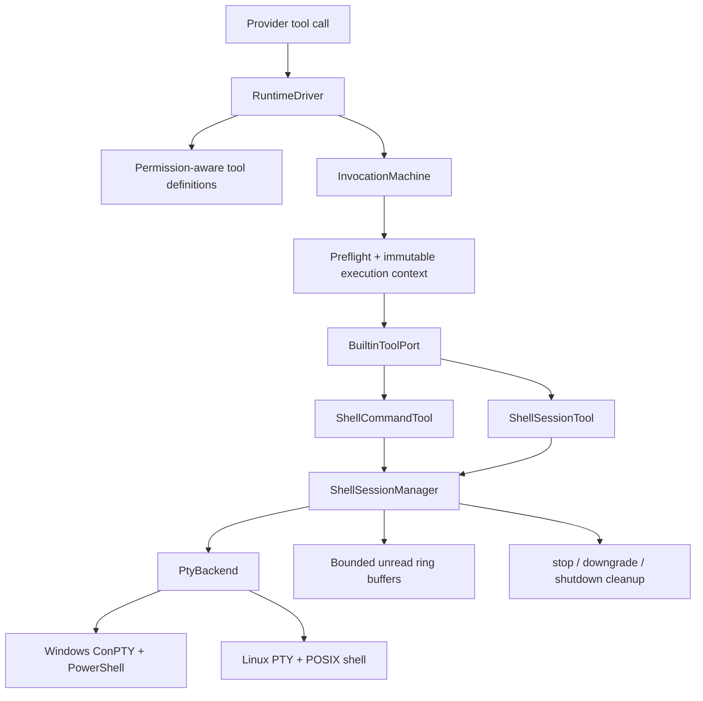

# MiniMax Codex 完全访问 Shell 设计

**日期：** 2026-07-21

**状态：** 用户已确认书面规格，进入实施计划

**分支：** `codex/full-access-shell-design`

**基线：** `5351d32`（`v0.1.1`）

## 1. 一句话目标

为 MiniMax Codex 增加与 Codex“完全访问”语义一致的本机 Shell：模型可以直接执行任意命令，并能继续读取长时间运行任务的输出、向交互式程序输入内容或显式停止整个进程树。

该功能使用 Rust 原生 PTY/ConPTY 会话管理器实现。Pi Agent Harness 只作为交互与进程管理的参考，不作为运行时、依赖或嵌套 Agent 引入产品。

## 2. 已确认的产品决定

1. Shell 仅在当前进程处于 `full-access` 时向模型开放并允许执行。
2. `full-access` 下不逐条弹出确认；切回 `confirm` 后立即停止所有仍在运行的 Shell 会话。
3. 支持一次性命令，也支持持续运行和需要输入的命令。
4. 模型侧只增加两个工具：`shell_command` 与 `shell_session`。
5. Windows 使用 ConPTY 和 PowerShell；Linux 使用 PTY 和本机 POSIX Shell。
6. 默认工作目录是当前项目根目录；`full-access` 允许显式指定项目外目录。
7. 命令没有白名单、路径限制或网络隔离。它拥有启动 MiniMax Codex 的用户所拥有的普通系统权限。
8. 会话不跨 MiniMax Codex 进程恢复。正常退出、权限降级或显式停止时必须清理进程树。
9. 保持 Rust-only 产品边界，不引入 Node.js、TypeScript、Pi、tmux 或外置终端窗口作为必需运行时。

## 3. 背景与被替代的旧约束

当前 Rust 工具层只有八个固定工具。进程工具支持异步启动、超时、输出上限、取消和进程树终止，但具有以下限制：

- 程序和参数来自固定适配器，不能执行任意 Shell 文本；
- `stdin` 被关闭，不能回答提示或驱动交互式程序；
- 子进程只在一次工具调用内存在，没有可继续访问的会话注册表；
- 环境被收窄并强制离线，不等同于用户自己的终端；
- 没有 PTY/ConPTY，很多检测终端能力的程序会改变行为或拒绝运行。

Phase 8 还明确规定 `full-access` 不能变成任意 Shell，并要求固定工具的命令、路径和 secret 门禁继续生效。本设计有意替代这一条旧约束，但只替代新 Shell 工具的执行边界：

- 现有八个工具继续保持原有 schema、路径、secret、超时、输出和 sandbox 规则；
- 新 Shell 工具在 `full-access` 下允许任意命令、任意现有工作目录、网络和普通用户环境；
- 工具协议大小、会话数量、输出缓存、取消、审计和进程清理仍是硬限制；
- `confirm` 继续使用现有受限工具，不获得任意 Shell。

因此，这不是给现有诊断工具添加一个新 action，而是一项新的产品与安全合同，必须进入新 milestone。

Shell 专用 preflight 不把 `command` 或 `cwd` 送入现有的 workspace path/secret-content 扫描；它只执行 schema、字段组合、容量、工作目录存在性、session ownership 和 full-access 权限检查。否则工具会在名义上支持任意 Shell、实际上仍被旧固定工具策略拦截，形成自相矛盾的合同。

## 4. 目标与非目标

### 4.1 目标

- 让模型在用户明确选择 `full-access` 后直接执行任意 PowerShell/POSIX Shell 命令。
- 让快速命令在单次工具调用内返回输出和退出码。
- 让长任务返回稳定 `session_id`，随后可以增量读取输出。
- 让工具向运行中的 PTY 写入 UTF-8 文本和 Enter 键。
- 让停止操作终止命令及其后代进程，而不只终止顶层 Shell。
- 对输出、输入和会话数量设置明确上限，避免无限内存增长。
- 保留现有 ToolInvocation、ToolResult、Agent 循环和持久化模型，不创建第二套 Agent runtime。
- 在 Windows 与 Linux 发布目标上提供真实 PTY 集成测试。

### 4.2 非目标

- 不为 `confirm` 模式实现 Windows/macOS 原生沙箱。
- 不在 v1 提供 Shell 命令白名单、逐条确认或细粒度目录权限。
- 不跨应用重启恢复运行中的进程或 PTY 句柄。
- 不实现完整终端模拟器、可视化 terminal pane、窗口 resize 工具或 ANSI 屏幕回放。
- 不保证可靠驱动 Vim、top 等全屏 TUI；它们可以启动，但 v1 只保证命令行提示、持续日志和标准交互输入。
- 不提供后台任务调度、开机启动、守护进程托管或远程 Shell。
- 不自动安装缺失的 Shell、Pi、tmux 或其他第三方工具。
- 不把 Pi 的模型循环、上下文、TUI、工具注册表或会话格式复制进产品。

## 5. 用户可见权限合同

### 5.1 进入完全访问

用户通过现有 `/permissions full-access` 或等价启动参数进入完全访问。界面必须在切换时明确说明：

- 命令不会再逐条询问；
- 命令可以读取、修改或删除启动用户可访问的文件；
- 命令可以使用网络、启动其他程序并读取应用可见的环境变量；
- 命令输出会成为工具结果，保存到本地会话，并发送给当前配置的远程 Provider 继续推理；
- 该权限只对当前 MiniMax Codex 进程有效，重启恢复 `confirm`。

这是一条告知，不是每条命令的审批框。

### 5.2 模式感知的工具暴露

Provider 请求中的工具定义必须按当前权限动态生成：

- `confirm`：只包含现有八个工具；
- `full-access`：包含现有八个工具以及 `shell_command`、`shell_session`。

仅隐藏 schema 不足以构成安全边界。工具 preflight 必须接收不可变的执行上下文，其中包含本次调用开始时快照的 `PermissionMode` 和 `ToolSandboxPolicy`。伪造、过期或 Provider 非法返回的 Shell 调用如果不是 `full-access + disabled sandbox`，必须在请求确认之前以 `shell_requires_full_access` 拒绝，并且执行零个子进程。

一次调用开始后，使用权限快照完成该调用，避免中途模式变化产生半批准状态；权限降级流程会立即阻止新 Shell 调用并清理已有会话。

### 5.3 切回 confirm

从 `full-access` 切回 `confirm` 时按以下顺序执行：

1. 原子地把 Shell manager 标记为 `draining`，拒绝新的 start/write；
2. 对全部 running session 发起整棵进程树终止；
3. 等待每棵进程树确认退出；
4. 清空 PTY writer、reader 和未读输出；
5. 将权限模式切换为 `confirm`，并刷新下一轮 Provider 工具定义。

如果无法确认某个进程树已经结束，权限仍要立即显示为 `confirm` 并继续拒绝新 Shell 调用，但界面必须显示高优先级清理失败警告和相关 `session_id`，不能静默声称权限已完全撤销。

### 5.4 进程退出

正常退出、会话关闭和 driver drop 都调用同一 `stop_all` 路径。每个 PTY child 还必须配置可用的 kill-on-drop/containment 保护。操作系统强制结束 MiniMax Codex、机器断电或内核崩溃时无法保证运行中的外部程序一定被清理；发布文档必须如实说明这一限制。

## 6. 工具协议

### 6.1 `shell_command`

用途：启动一条新命令并等待一小段时间。如果命令很快结束，直接返回最终结果；否则返回可继续操作的 `session_id`。

参数：

```json
{
  "command": "npm test",
  "cwd": "E:\\project",
  "yield_time_ms": 10000,
  "max_output_bytes": 16384
}
```

合同：

- `command` 必填，UTF-8，去除首尾空白后不能为空，最大 32 KiB；
- `cwd` 可选，最大 4 KiB；省略时使用项目根目录；可以是绝对路径或相对项目根目录的路径；最终路径必须存在且是目录；
- `yield_time_ms` 可选，范围 250 到 60000，默认 10000；它只控制首轮等待，不是进程总超时；
- `max_output_bytes` 可选，范围 1024 到 49152，默认 16384；
- 命令没有默认总运行时限。它一直运行到自然退出、显式 stop、权限降级或应用退出；
- 命令通过 Shell 的“命令参数”传入，不拼接成第二层命令行，避免产品自身再次解释引号。

### 6.2 `shell_session`

用途：操作 `shell_command` 返回的运行中会话。

参数：

```json
{
  "session_id": "shell-7f0c-0001",
  "action": "poll",
  "input": "yes",
  "submit": true,
  "yield_time_ms": 1000,
  "max_output_bytes": 16384
}
```

字段：

- `session_id` 必填，最大 128 字节，只接受当前进程 manager 已分配的 opaque ID；
- `action` 必填，只能是 `poll`、`write` 或 `stop`；
- `input` 只允许用于 `write`，UTF-8，单次最大 16 KiB；
- `submit` 只允许用于 `write`，默认 `false`；为 `true` 时在 input 后写入当前平台的 Enter 序列；
- `yield_time_ms` 用于 `poll` 或 `write` 后等待新输出，范围 0 到 60000，默认分别为 1000 和 250；
- `max_output_bytes` 规则与 `shell_command` 相同；
- `poll` 不接受 `input` 或 `submit`；
- `write` 必须满足“非空 input”或 `submit=true` 至少一项；
- `stop` 不接受 `input`、`submit` 或非零 `yield_time_ms`。

当前 JSON schema 验证器不支持条件分支，因此公共 schema 只做字段类型和静态范围验证，action 对应的字段组合由 Shell preflight 再次严格校验。无效组合执行零次写入和零次停止。

### 6.3 统一结果

两个工具都把以下 JSON 序列化到现有 `ToolResult.output`：

```json
{
  "session_id": "shell-7f0c-0001",
  "state": "running",
  "exit_code": null,
  "output": "server listening on 3000\n",
  "output_truncated": false
}
```

规则：

- `state` 只能是 `running`、`exited`、`stopped` 或 `failed`；
- `exit_code` 只在操作系统提供退出码时出现；
- `output` 只包含本次调用尚未交付过的增量文本；
- 每次成功交付后移动 manager 内部的 unread cursor，模型不需要维护 offset；
- 一次结果最多包含 `max_output_bytes`，剩余未读内容留给下一次 poll；
- 如果 ring buffer 在读取前已溢出，丢弃最旧内容并设置 `output_truncated=true`；该标记至少保持到下一次成功交付；
- PTY 的 stdout/stderr 是合并流，结果不虚构两个独立通道；
- 输出按 UTF-8 lossily 解码，移除 NUL 与不可展示控制字符，保留换行、回车和制表符；ANSI/VT 转义序列转换为稳定纯文本，不保存完整虚拟屏幕状态。

ToolResult 状态与 code：

| 情况 | terminal status | code |
| --- | --- | --- |
| 已启动且仍运行 | `succeeded` | `shell_running` |
| 退出码为 0 | `succeeded` | `shell_exited` |
| 非零退出码 | `failed` | `shell_nonzero_exit` |
| 用户或权限降级停止成功 | `succeeded` | `shell_stopped` |
| PTY/Shell 启动失败 | `failed` | `shell_launch_failed` |
| 会话不存在或已回收 | `rejected` | `shell_session_not_found` |
| action/字段组合无效 | `rejected` | `invalid_arguments` |
| 不是 full-access | `rejected` | `shell_requires_full_access` |
| 进程树无法确认停止 | `indeterminate` | `shell_stop_indeterminate` |

`shell_command` 返回 `shell_running` 时，本次 ToolInvocation 已经正常 terminal；继续运行的是 manager 拥有的 PTY session，而不是悬空的 ToolInvocation。这保持现有 InvocationMachine 的“一次调用只有一个终态”合同。

## 7. Shell 与环境选择

### 7.1 Windows

1. 优先解析 `pwsh.exe`；
2. 如果不存在，解析系统 `powershell.exe`；
3. 两者都不存在则返回 `shell_launch_failed`，不回退到 `cmd.exe`；
4. 使用 `-NoLogo -NoProfile -Command <command>` 启动，保持可交互 stdin，不使用 `-NonInteractive`；
5. 通过 ConPTY 提供固定初始终端尺寸 120 列 × 30 行。

### 7.2 Linux

1. 如果 `$SHELL` 是绝对、存在且可执行的文件，则使用它；
2. 否则依次尝试 `/bin/bash`、`/bin/sh`；
3. 使用 `-lc <command>` 启动；
4. 通过 PTY 提供固定初始终端尺寸 120 列 × 30 行。

### 7.3 环境

Shell 继承 MiniMax Codex 进程的普通环境，以便 `cargo`、`npm`、`git`、编译器和用户工具保持与真实终端一致。它不强制 offline、不替换用户配置、不移除项目本地 PATH，也不设置 `GIT_TERMINAL_PROMPT=0`。

这意味着应用环境中的 token 或 credential 可能被命令读取。产品不能同时承诺“任意完整 Shell”和“Shell 无法访问启动用户可访问的秘密”；该风险必须在进入 `full-access` 时明确告知。MiniMax Codex 自己不额外把 keyring 中的 Provider credential 写入子进程环境。

## 8. 架构



### 8.1 Protocol 层

`minimax-protocol`：

- 将 `shell_command`、`shell_session` 加入版本化工具名称合同；
- 保持 `ToolEffect::Process`，不增加新的 effect 枚举；
- 增加 Shell receipt 的可序列化类型和 round-trip 测试；
- 保持现有单次工具结果 64 KiB 上限，Shell 文本上限 49152 字节为 JSON 元数据留出空间。

### 8.2 Core 层

`minimax-core`：

- 引入 `ToolExecutionContext { permission_mode, sandbox_policy }`；
- 让 ToolPort preflight 与 execute 接收同一个不可变上下文；
- 保持 InvocationMachine 状态图不变；
- 权限快照在 preflight 前创建，decision、execute 与持久化都引用同一快照；
- `confirm` 下的 forged Shell 调用在 approval 之前终止。

### 8.3 Tools 层

`minimax-tools` 新增聚焦的 `shell/` 模块，而不是继续扩大 `process.rs`：

- `ShellCommandTool`：解析、验证并启动命令；
- `ShellSessionTool`：执行 poll/write/stop；
- `ShellSessionManager`：拥有 session registry、生命周期和容量限制；
- `PtyBackend`：隔离 Windows/Linux PTY 细节，测试可注入 fake backend；
- `ShellSession`：拥有 child、master writer、reader task、状态与 ring buffer；
- `ShellOutputBuffer`：只负责增量读取、截断和文本规范化；
- `ShellProcessTree`：复用并抽取当前进程工具的 Linux process-group 与 Windows tree-kill 逻辑。

首选 PTY 实现是精确锁定的 Rust `portable-pty` 0.9.0。它提供跨平台 PTY、ConPTY、command builder、reader/writer 和 child 状态接口；PTY 读取是阻塞的，因此每个 session 使用一个受控 blocking reader worker，通过有界 channel 把 chunk 送回 Tokio manager。依赖进入 lockfile 前必须通过 license、MSRV、Windows/Linux build 和真实 PTY 验收；任何一项失败都阻止发布，而不是回退到 piped stdio 假装完成。

### 8.4 CLI/Driver 层

`RuntimeDriver`：

- 不再永久保存一份静态工具定义；每轮 Provider 请求根据权限快照过滤 Shell 工具；
- 拥有可关闭的 BuiltinToolPort/ShellSessionManager；
- 权限切换变为可失败的生命周期操作，而不是只修改枚举字段；
- 取消仍在 `shell_command` 首轮等待中的 ToolInvocation 时，终止刚启动的 session，避免未返回 ID 的孤儿任务；
- 已经返回 `session_id` 的 session 不因后续 Agent turn 取消而自动停止，必须由 stop、权限降级或应用退出清理。

## 9. 会话生命周期与资源上限

### 9.1 状态

```text
starting -> running -> exited
                   -> stopped
                   -> failed
```

- `starting` 不是模型可见状态；启动成功后才分配并公开 `session_id`；
- 启动失败不占用 registry 名额；
- `write` 只允许 `running`；
- `poll` 允许 `running` 和尚未回收的 terminal session；
- `stop` 对已 terminal session 幂等返回其终态，不重复 kill。

### 9.2 固定上限

- 同时最多 8 个 running session；
- 每个 session 最多保留 1 MiB 未读输出；
- 全部 session 未读输出合计最多 8 MiB；
- 每次 tool result 最多交付 49152 字节 Shell 文本；
- 每次 write 最多 16 KiB；
- 已 terminal 且输出已经交付完的 receipt 最多保留 32 个或 5 分钟，以先达到者为准；
- running session 没有自动空闲超时，以免误杀服务器、测试和编译任务。

manager 使用进程级随机 nonce 加单调计数器生成 `shell-<nonce>-<counter>`，测试通过注入 ID source 获得确定性。ID 只在当前 MiniMax Codex 进程有效，不写入可恢复运行状态。

### 9.3 输出读取

每个 PTY reader worker 只做阻塞 read 和有界 channel 发送。manager 消费 chunk、规范化文本并追加到 ring buffer。channel 满时 worker 不无限分配内存；它等待 manager 或在 shutdown 信号后退出。ring buffer 满时丢弃最旧未读字节，并记录截断事实。

### 9.4 停止

`stop`、权限降级和正常退出共用相同算法：

1. 将 session 标为 stopping，拒绝新 write；
2. 尝试向 PTY 写入平台合适的中断序列；
3. 最多等待 2 秒自然退出；
4. 仍运行则终止整棵进程树；
5. 最多再等待 2 秒确认 child 退出；
6. 关闭 PTY master，join reader worker，并发布 `stopped`；
7. 无法确认时返回 `shell_stop_indeterminate` 并保留诊断 receipt。

Windows 使用当前项目已有的 `taskkill /T /F` 树终止策略作为强制回退；Linux 使用独立 process group 的 TERM/KILL 路径。真实集成测试必须证明“父 Shell 启动子进程”后 stop 不留下子进程。

## 10. 错误、取消与恢复

- 无效 cwd、缺失 Shell、PTY 创建失败和容量耗尽都在启动任何命令前返回明确失败码。
- `shell_command` 在 spawn 之后、返回 `session_id` 之前被取消时，必须执行 stop；如果无法确认停止，ToolResult 为 `indeterminate`。
- `poll` 被取消不改变 session。
- `write` 在实际写入前被取消，执行零写入；写入后取消则返回 `indeterminate`，因为输入可能已经产生副作用，session 保持可 poll/stop。
- Provider 重试不能自动重放 `shell_command` 或 `write`。现有 invocation/call ID 去重继续适用。
- 应用重启后旧 `session_id` 返回 `shell_session_not_found`；不尝试猜测或重新附着操作系统进程。
- 命令输出不进入模型私密推理字段，但作为普通 ToolResult 遵循现有本地持久化、safe trace 和 Provider message 流程。
- safe trace 只记录工具名、session ID、状态、退出码、字节数、是否截断和耗时，不复制完整命令、输入或输出。

## 11. Pi 参考边界

采用的参考原则：

- 按平台选择符合用户预期的 Shell；
- 结果必须明确表达退出状态和被截断的输出；
- 命令执行和 Agent 对话保持清晰的工具边界；
- 长任务需要后续可观察、可输入和可停止。

明确不采用：

- 不把 Pi coding-agent 嵌入 MiniMax Codex；
- 不建立 `MiniMax Agent -> Pi Agent -> Shell` 的双层模型循环；
- 不使用 Pi 的 TypeScript/Node runtime、session persistence、TUI 或扩展系统；
- 不依赖 Pi 本身未内置的 background Bash；
- 不把 Pi“继承启动用户全部权限”误写成安全隔离机制。

参考来源：

- [Pi 官方仓库](https://github.com/earendil-works/pi)
- [Pi coding-agent 使用说明](https://github.com/earendil-works/pi/blob/main/packages/coding-agent/docs/usage.md)
- [portable-pty 0.9.0 文档](https://docs.rs/portable-pty/0.9.0/portable_pty/)

## 12. 测试与验收

### 12.1 协议与单元测试

- 两个工具 schema 名称、字段、枚举、长度和 unknown-field 拒绝；
- action/字段组合矩阵；
- receipt JSON round-trip 与 64 KiB 总结果上限；
- ring buffer 增量读取、跨 UTF-8 chunk、截断标记和多次 poll；
- session 状态机、terminal 幂等、容量和 receipt GC；
- ID source 唯一性与测试确定性；
- 输出控制字符和 ANSI 规范化。

### 12.2 权限与 Agent 回归

- `confirm` Provider 请求看不到两个 Shell schema；
- `full-access` Provider 请求能看到且只多出两个 Shell schema；
- forged confirm-mode Shell 调用在 approval 前拒绝，执行零进程；
- full-access 不请求 per-command approval；
- 切回 confirm 阻止新 start/write，并停止全部 running session；
- 重启恢复 confirm，旧 session ID 无效；
- 现有八个工具在两种权限下的旧合同不变；
- running receipt 仍让 InvocationMachine 正常进入 terminal，不制造悬空 invocation；
- tool call 重试不重复启动或重复写入。

### 12.3 真实 PTY 集成

Windows 和 Linux 各自验证：

1. 快速命令返回输出、退出码 0 和 `shell_exited`；
2. 非零命令返回原始退出码和 `shell_nonzero_exit`；
3. 持续输出命令返回 running session，连续 poll 只得到新增输出；
4. 提示型程序从 write + submit 收到输入并退出；
5. PTY 检测程序确认 stdin/stdout 是 terminal；
6. cwd 默认值、相对目录和项目外绝对目录符合合同；
7. stop 终止父进程及其子进程；
8. 权限降级终止全部会话；
9. 1 MiB 输出触发有界截断而不增长到上限之外；
10. 应用正常退出不留下已启动进程；
11. 中文、emoji 和跨 chunk UTF-8 输出稳定；
12. PowerShell 与 POSIX Shell 的引号、管道和多命令表达式按各自原生规则执行。

### 12.4 发布门禁

- `cargo fmt --all -- --check`；
- `cargo clippy --workspace --all-targets --all-features -- -D warnings`；
- `cargo test --workspace --all-targets --all-features`；
- Windows 与 Linux hosted CI 都运行真实 PTY smoke，不只运行 fake backend；
- npm 预构建包测试证明没有新增 Node/Pi/外部终端运行时；
- dependency/license/MSRV 审核记录 `portable-pty` 及其传递依赖；
- README、`/permissions`、doctor 和 release security 文档同步新的 full-access 风险；
- Phase 8 中“full-access 仍禁止任意 Shell”的旧说明被显式标记为已由新 milestone 替代，不能同时保留矛盾陈述。

## 13. 实施边界与顺序

该设计可以由一个新 milestone 完成，但实施计划必须按以下依赖顺序拆成可独立验证的任务：

1. 协议与 permission-aware ToolExecutionContext；
2. 有界 session manager、fake backend 和状态机测试；
3. Windows/Linux PTY backend 与进程树终止；
4. 两个工具适配器和动态 schema 暴露；
5. driver 权限降级、取消和 shutdown 生命周期；
6. 真实 PTY、Agent、打包和安全文档验收。

任何阶段如果只能做到 piped stdin/stdout、外置终端窗口或嵌套 Pi，都不算完成本设计，不能以“部分支持交互”通过验收。

## 14. 完成定义

只有同时满足以下条件，功能才可声明完成：

- 用户进入 full-access 后，Agent 可无逐条确认执行任意 Shell 命令；
- 快速、长时间和交互式命令均通过 Windows/Linux 真实 PTY 测试；
- Agent 可以可靠 poll、write、submit 和 stop；
- stop、权限降级和正常退出能终止真实子进程树；
- confirm 下模型看不到 Shell 工具，伪造调用也无法越权；
- 输出和 session 内存上限经过测试，不存在无限增长；
- 现有八个工具和 Agent invocation 持久化合同没有回归；
- 产品仍是 Rust-only 运行时，Pi 仅保留为设计出处；
- 用户文档如实说明 full-access 可以接触文件、网络、环境 credential，以及工具输出会发送给远程 Provider。
